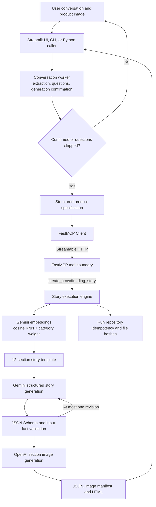

<p align="center">
  
</p>

<p align="center">
  <a href="https://www.python.org/"></a>
  <a href="https://docs.astral.sh/uv/"></a>
  <a href="https://gofastmcp.com/"></a>
  <a href="https://github.com/langchain-ai/langgraph"></a>
  <a href="https://github.com/pakyeon/funding-story-ai/actions/workflows/ci.yml"></a>
</p>

<p align="center">
  English | <a href="./i18n/README-KR.md">한국어</a>
</p>

<p align="center">
  An experimental implementation that completes missing product information through questions<br>
  and generates crowdfunding-page text, images, and editable HTML.
</p>

---

Funding Story AI runs conversational intake, template retrieval, story generation, image
generation, and result validation as separate stages. The conversation worker structures product
information and confirms whether generation should begin. It delegates the actual generation job
to an execution engine through a FastMCP tool.

[Features](#what-does-funding-story-ai-do) · [Quick Start](#-quick-start) ·
[UI demo](#-streamlit-demo) · [Example](#-included-example-synthetic-robot-vacuum) · [Architecture](#-architecture) ·
[Implementation](#implementation-scope) · [Limitations](#-current-scope-and-limitations)

## What does Funding Story AI do?

### Collect structured product information

It structures the following information from the user's text and product images:

- Product name and product type
- Key features
- Intended backers and use environments
- Problems the product is intended to solve
- Evidence such as tests, certifications, and reviews
- Maker and team information

Images are used only for directly visible appearance information, such as color and shape. The
system does not infer performance, certifications, internal construction, or supported features
from an image.

### Ask follow-up questions and confirm generation

When required information is missing, the system generates follow-up questions from examples in
the category profile. A field explicitly answered as “none” is treated as complete. Conflicting
information is resolved by confirming the final value, and no generation tool is called until the
user confirms generation or asks to skip the remaining questions.

### Retrieve a story template

The system converts structured product information and 16 retrieval candidates into vectors and
calculates cosine similarity. A configurable weight is added to candidates in the same product
category. Six of the current candidates are executable story templates.

### Generate text and images

The selected template defines 12 story sections. The system generates the crowdfunding copy for
those sections and creates images for the `hero`, `solution`, and `features` sections using the
provided product reference image while preserving its visible appearance.

### Validate and store the result

The result is checked for numbers, features, certifications, schedules, and future promises that
are absent from the input. Product information, story copy, an image manifest, and an editable HTML
preview are stored as one run, along with SHA-256 hashes for generated files. Every result still
requires final human review.

## 🚀 Quick Start

### 1. Install

Python 3.12, [uv](https://docs.astral.sh/uv/), and the Google Cloud CLI are required.

```bash
git clone https://github.com/pakyeon/funding-story-ai.git
cd funding-story-ai
uv sync --locked
cp .env.example .env
gcloud auth application-default login
```

### 2. Configure the environment

Set the following values in `.env`:

```dotenv
GOOGLE_CLOUD_PROJECT=your-gcp-project
OPENAI_API_KEY=your-openai-api-key
```

See [`.env.example`](.env.example) for all model, region, and output-size settings.

### 3. Start the generation server

Start the local FastMCP server in the first terminal:

```bash
uv run funding-story server --host 127.0.0.1 --port 8765
```

The server is accessible only from the local machine by default.

### 4. Generate a crowdfunding page

Submit the included product specification and reference image from a second terminal:

```bash
uv run funding-story submit \
  --brief-path examples/robot-vacuum/brief.json \
  --reference-image examples/robot-vacuum/product-reference.png \
  --category-profile robot-vacuum-ko-v1 \
  --idempotency-key robot-vacuum-demo-v1 \
  --live
```

The completed run is written under `artifacts/runs/run-…/`:

```text
brief.json                 # Structured product information used as input
story.json                 # Generated copy and evidence fields
images/manifest.json       # Per-image status and review state
images/{section}.jpeg      # Generated section images
preview.html               # Editable result preview
```

Repeating a request with the same requester, `--idempotency-key`, and input returns the existing
run. Reusing the key with different input returns an idempotency error.

## 🖥 Streamlit demo

The UI is maintained on the `feat/streamlit-demo` branch and calls the same conversation worker
and local FastMCP generation tool as the command-line flow. It is intended for local feature
demonstrations, not deployment.

Start the generation server in the first terminal:

```bash
uv run funding-story server --host 127.0.0.1 --port 8765
```

Start the UI in a second terminal:

```bash
uv sync --locked --group ui
uv run --group ui streamlit run streamlit_app.py
```

Open `http://127.0.0.1:8501`, attach an optional product reference image, and describe the
product. The UI presents follow-up questions, asks for explicit generation confirmation, and then
shows the HTML preview, section copy, generated images, and JSON result. API credentials remain in
the local `.env` file and are not entered into the UI.

## Conversational input

The conversation worker determines the input state and delegates an approved generation request to
the FastMCP server.

```python
import asyncio

from funding_story_ai import WorkerRequest, build_live_worker

agent = build_live_worker()
result = asyncio.run(
    agent.handle(
        WorkerRequest(
            input_id="robot-demo-01",
            initial_message=(
                "This robot vacuum has a slim body and automatic dust emptying. "
                "I want a page for people who need frequent cleaning under furniture."
            ),
        )
    )
)

print(result.status)
print(result.questions)
```

The caller must retain the returned `semantic_state` and conversation history. Generation does not
begin until a follow-up request sets `confirmed=True` or `skip_requested=True`.

## 🧹 Included example: synthetic robot vacuum

<p align="center">
  
</p>

This example is synthetic data, not an actual product or crowdfunding page.

| Input area | Example content | Processing behavior |
|---|---|---|
| Product facts | Suction power, operating time, mop and charging-dock specifications | Values are linked to source IDs |
| User problem | Repetitive cleaning and post-cleaning maintenance | Used for questions and retrieval queries |
| Evidence | Two synthetic internal tests | Kept distinct from external certification |
| Unknowns | Price, shipping date, external certification, warranty | Remain unknown instead of being invented |
| Result | 12 common section roles and 3 images | Returns JSON, HTML, image manifest, and warnings |

Example files:

- [`brief.json`](examples/robot-vacuum/brief.json) — product information, sources, and unknown fields
- [`product-reference.png`](examples/robot-vacuum/product-reference.png) — synthetic product image
- [`robot-vacuum-ko-v1.json`](profiles/robot-vacuum-ko-v1.json) — category extraction and question profile

## Input scenarios

### When product information is sufficient

When the product name, features, intended backers, and evidence are present, the system reduces
follow-up questions and proceeds to generation confirmation.

### When evidence is unavailable

When the user explicitly says tests, certifications, reviews, or team information are unavailable,
that absence is recorded as a fact. The system does not create the missing evidence and marks the
relevant result sections for review.

### When product specifications changed

When both an earlier and a current value are provided, the system confirms the final value. A
reference image of a retired prototype is not used for new image generation.

### When tuning template retrieval

The category weight can be set to `0.0`, `0.1`, or `0.2`. Retrieval behavior can be compared using
both same-category candidates and intentionally confusing candidates from other categories.

## 🏗 Architecture



### Component responsibilities

| Component | Responsibility | Does not perform |
|---|---|---|
| Streamlit UI | Local conversation, reference-image upload, and result presentation | Credentials or generation logic |
| Conversation worker | Text and image extraction, questions, generation confirmation | Story or image generation |
| FastMCP tool boundary | Input validation, job creation, result retrieval, idempotency | Story writing |
| Template retriever | Vector similarity and category weighting | Model-generated content |
| Execution engine | Assemble text, images, and HTML into one run | Conversation-state management |
| Result validator | Check JSON shape, numbers, unsupported claims, and evidence fields | Verify external facts |

See [Architecture](docs/architecture.md) for implementation details.

## Implementation scope

| Area | Current implementation |
|---|---|
| Conversational input | Gemini text and image analysis with a LangGraph question flow |
| Generation authority | One FastMCP generation tool callable by the conversation worker |
| Transport | FastMCP 3.x Streamable HTTP restricted to loopback addresses |
| Run management | Per-requester idempotency, asynchronous jobs, and result retrieval |
| Templates | Six persuasion strategies with 12 common output sections |
| Retrieval | Full cosine KNN over 16 candidates, 768-dimensional vectors, and category weighting |
| Text | Gemini 3.7 Flash first; Gemini 3.6 Flash after five access failures |
| Validation | JSON Schema plus checks for unsupported numbers, features, schedules, and certifications |
| Images | `gpt-image-2`, three primary sections, isolated per-image failure handling |
| Result | Product specification, story, image manifest, HTML, and SHA-256 hashes |

## Interpreting results

`automated_validation_passed` does not mean external facts have been verified. It means the current
validators found neither a contradiction between the input and output nor a registered unsupported
claim.

1. User statements remain distinct from externally verified evidence.
2. Performance, certifications, and internal construction are not inferred from images.
3. Missing price, schedule, review, warranty, and support information is not invented.
4. A validation warning or image failure changes the run status to `partial`.
5. Every result has `review_required: true`; generated images require separate review.

## Development validation

These commands are for repository regression checks, not the normal generation flow:

```bash
uv lock --check
uv run ruff check .
uv run pytest
uv run funding-story validate
```

Current repository checks cover:

- 62 pytest tests
- 11 JSON Schemas
- Six executable 12-section templates
- 16 retrieval candidates
- FastMCP job, result retrieval, and idempotency regressions
- One robot-vacuum category profile and one synthetic input package

In the second private holdout case used during the preceding behavior study, the full conversation
worker → FastMCP → retrieval → execution-engine path completed. The external reference proceeded to
generation confirmation for an input where the experimental implementation returned an additional
question. The current implementation now treats an explicit “none” as a completed answer, but this
does not establish complete behavioral parity with the external service.

## Repository layout

```text
funding-story-ai/
├── src/funding_story_ai/
│   ├── worker.py             # Conversation intake, questions, and specification building
│   ├── mcp_server.py         # Single FastMCP generation tool
│   ├── template_retrieval.py # Vector retrieval and category weighting
│   ├── engine.py             # Integrated execution engine
│   └── ...                   # Story, validation, image, and HTML generation
├── schemas/                  # JSON input and output contracts
├── templates/                # Six templates and retrieval candidates
├── profiles/                 # Category extraction and question profiles
├── examples/                 # Synthetic input examples
├── docs/                     # Architecture and research-scope documents
└── tests/                    # Regression tests without external model calls
```

## 📚 Documentation

- [Architecture](docs/architecture.md)
- [Template and retrieval system](docs/template-system.md)
- [Input-grounded validation](docs/factuality-and-validation.md)
- [Category profiles](docs/category-profiles.md)
- [Observable Story AI behavior](docs/research/observable-story-ai-behavior.md)
- [PoC evaluation summary](docs/research/poc-evaluation-summary.md)
- [Current limitations](docs/research/limitations.md)

## ⚠️ Current scope and limitations

- Question-flow and output-quality comparisons are limited to Korean robot-vacuum inputs.
- No web interface persists conversation state.
- The run repository is intended for single-process local development and provides no user authentication or authorization.
- The 16 retrieval candidates are a reduced set for testing retrieval behavior.
- No causal relationship between a template and crowdfunding performance has been established.
- External fact retrieval, advertising review, and rights review are outside the scope.
