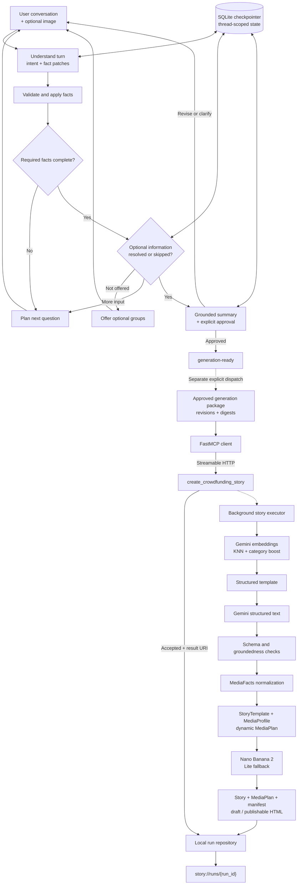

<p align="center">
  
</p>

<p align="center">
  <a href="https://www.python.org/"></a>
  <a href="https://docs.astral.sh/uv/"></a>
  <a href="https://gofastmcp.com/"></a>
  <a href="https://github.com/langchain-ai/langgraph"></a>
</p>

<p align="center">
  English | <a href="./i18n/README-KR.md">한국어</a>
</p>

<p align="center">
  Turn product conversations into reviewable crowdfunding copy,<br>
  generated images, and editable HTML.
</p>

---

Funding Story AI is a review-first pipeline for preparing crowdfunding stories. It collects
maker-provided product information through a conversation, asks for missing details, and presents
a grounded summary for approval. A separately approved request then runs template retrieval, text
generation, image generation, validation, and HTML rendering as an asynchronous job.

[Features](#what-does-funding-story-ai-do) · [Quick Start](#-quick-start) ·
[Example](#-included-example) · [Architecture](#-architecture) · [Output](#-what-you-get)

## What does Funding Story AI do?

### Conversational intake

- Accepts one user message of up to 1,000 characters and one optional JPG, PNG, or WEBP image up to
  10 MB.
- Collects 16 story inputs, including product identity, category, strengths, audience, problem,
  evidence, maker information, rewards, schedule, policies, funding plan, platform choice, and
  risk response.
- Uses a dialogue model to understand intent, fact changes, optional-information choices, and the
  next question. LangGraph keeps the conversation state for each `thread_id`.
- Groups follow-up questions by purpose and asks for no more than three related fields at a time.
- Separates information that was provided, explicitly absent, or skipped for the current story.
- Summarizes the collected information and requires explicit approval before the conversation reaches
  `generation-ready`.
- Uses an uploaded image only for directly visible appearance. Performance, certification, internal
  construction, and team history are not inferred from an image.

### Template-based story generation

- Builds a product query and ranks structured templates with `gemini-embedding-001` and exact cosine
  KNN retrieval.
- Adds a configurable same-category boost to the semantic score and selects an executable template.
- Fills the selected section layout with structured Gemini output while preserving source fields for
  review.
- Produces section-level image instructions from the selected layout.

### Planned images and publishable HTML

- Normalizes approved product facts into eight robot-vacuum capability groups.
- Combines the selected story template with a product-family media profile to create a dynamic
  `MediaPlan` of up to eight grounded image slots.
- Uses Nano Banana 2 (`gemini-3.1-flash-image`) with Nano Banana 2 Lite
  (`gemini-3.1-flash-lite-image`) as a bounded fallback, and sends only each slot's declared
  reference assets.
- Records model, attempts, hashes, grounding references, and human-review checks in an image
  manifest.
- Always writes a clean 740 px draft page. Publishable HTML is emitted only after required facts,
  assets, generation, and image review have all passed.

## 🚀 Quick Start

### 1. Install

Python 3.12, [uv](https://docs.astral.sh/uv/), and the Google Cloud CLI are required.

```bash
git clone https://github.com/pakyeon/funding-story-ai.git
cd funding-story-ai
uv sync --locked
cp .env.example .env
gcloud auth application-default login
```

### 2. Configure

Set the Google Cloud project in `.env`.

```dotenv
GOOGLE_CLOUD_PROJECT=your-gcp-project
GEMINI_IMAGE_MODEL=gemini-3.1-flash-image
GEMINI_IMAGE_FALLBACK_MODEL=gemini-3.1-flash-lite-image
```

Model, retry, output, and retrieval settings are listed in [`.env.example`](.env.example).

### 3. Start the local generation server

```bash
uv run funding-story server --host 127.0.0.1 --port 8765
```

The server listens on the local loopback address.

### 4. Submit an approved generation package

Run this in a second terminal:

```bash
uv run funding-story submit \
  --generation-package path/to/approved-generation-package.json \
  --idempotency-key robot-vacuum-demo-v2 \
  --live
```

The package is produced by `StoryGenerationDispatcher` only after the conversation's current
summary is explicitly approved. The command submits that immutable package and polls its
`story://runs/{run_id}` resource until completion or failure.

## Conversational API

```python
import asyncio

from funding_story_ai import WorkerRequest, build_live_worker

worker = build_live_worker()
outcome = asyncio.run(
    worker.handle(
        WorkerRequest(
            thread_id="demo-conversation-01",
            input_id="demo-01",
            message=(
                "클린포지 R1은 가구 아래를 자주 청소하는 사용자를 위한 "
                "얇은 로봇청소기이며 도크가 모인 먼지를 비웁니다."
            ),
        )
    )
)

print(outcome.stage)
print(outcome.reply)
```

Use the same `thread_id` for every turn in one conversation. The LangGraph SQLite checkpointer
keeps messages, structured facts, optional-information state, question history, the current summary,
and its approval version. The worker stops at `generation-ready`; generation submission is a
separate explicit operation.

## 🧹 Included example

<p align="center">
  
</p>

The included robot vacuum is synthetic and is not an actual product or campaign. Its files provide
a ready-to-run input package:

- [`brief.json`](examples/robot-vacuum/brief.json) — product facts, claims, evidence, and unknowns
- [`product-reference.png`](examples/robot-vacuum/product-reference.png) — reference image

## 🏗 Architecture



The conversation worker and the generation executor have separate responsibilities. A generation
request is accepted only from an approved `generation-ready` state.

## What you get

A completed run contains the following artifacts:

```text
brief.json                 # Grounded structured input
story.json                 # Generated sections and source fields
media-facts.json            # Approved facts normalized for media planning
media-plan.json             # Active slots, placement, references, and placeholders
images/manifest.json        # Models, attempts, hashes, grounding, and review checks
images/{slot}.{format}      # Independently generated MediaPlan slot images
draft.html                  # Pure funding-page HTML with fixed placeholders
publishable.html            # Present only after every publishing gate passes
```

The same caller, idempotency key, and input return the existing run. Reusing an idempotency key with
different input is rejected.

## Usage notes

- The included conversation and example templates are written for the Korean-language workflow.
- Review generated text, images, warnings, and source fields before publishing.
- Keep API credentials in `.env` and do not commit that file.

## Learn more

- [Architecture](docs/architecture.md)
- [Template and retrieval system](docs/template-system.md)
- [Input-grounded validation](docs/factuality-and-validation.md)
