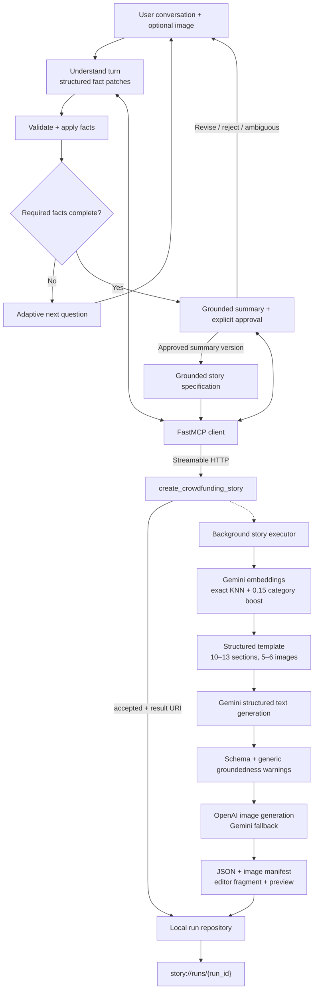

<p align="center">
  
</p>

<p align="center">
  <a href="https://www.python.org/"></a>
  <a href="https://docs.astral.sh/uv/"></a>
  <a href="https://gofastmcp.com/"></a>
  <a href="https://github.com/langchain-ai/langgraph"></a>
</p>

<p align="center">
  English | <a href="./i18n/README-KR.md">한국어</a>
</p>

<p align="center">
  An experimental implementation that turns product conversations into reviewable<br>
  crowdfunding copy, generated images, and editable HTML.
</p>

---

Funding Story AI separates conversational intake from story execution. A dialogue model extracts
maker-provided facts and decides which follow-up question to ask. After explicit confirmation, a
single FastMCP tool submits an asynchronous run to the template retrieval, text generation, image
generation, validation, and rendering pipeline.

[Features](#what-does-funding-story-ai-do) · [Quick Start](#-quick-start) ·
[Example](#-included-example) · [Architecture](#-architecture) ·
[Scope](#implementation-scope) · [Limitations](#-current-limitations)

## What does Funding Story AI do?

### Conversational intake

- Accepts a user message of up to 1,000 characters and one optional JPG, PNG, or WEBP image up to
  10 MB.
- Extracts product identity, category, strengths, audience, problems, evidence, maker information,
  rewards, schedule, policies, funding plan, platform choice, and risk response.
- Uses the dialogue LLM—not a product profile or UI flag—to decide whether to ask one question,
  combine closely related fields, or proceed to confirmation.
- Supports Korean, English, Japanese, and Chinese state and output contracts.
- Treats images only as evidence for directly visible appearance. It does not infer performance,
  certification, internal construction, or team history from an image.

### Template retrieval and story generation

- Embeds a product specification and 16 reduced retrieval candidates with
  `gemini-embedding-001`.
- Ranks candidates with exact cosine KNN and a default same-category soft boost of `0.15`.
- Selects the highest-ranked executable template when a research-only candidate has no executable
  layout.
- Fills the selected structured template with Gemini. The six local templates contain 10–13
  sections and request 5–6 images according to their own layout contracts.

### Images, review, and editable output

- Uses `gpt-image-2` first when an OpenAI key is configured, then falls back to
  `gemini-2.5-flash-image`; each provider is tried up to three times.
- Embeds an AI-generation marker in valid PNG or JPEG output and records provider, model, MIME type,
  attempts, hash, and review state in the image manifest.
- Displays successfully generated images while clearly marking them as awaiting human review.
- Records validation warnings without regenerating the whole story.
- Writes both a standalone review preview and a conservative editor fragment designed for import
  into a Froala-style HTML editor.

## 🚀 Quick Start

### 1. Install

Python 3.12, [uv](https://docs.astral.sh/uv/), and the Google Cloud CLI are required.

```bash
git clone https://github.com/pakyeon/funding-story-ai.git
cd funding-story-ai
uv sync --locked
cp .env.example .env
gcloud auth application-default login
```

### 2. Configure

Set your GCP project in `.env`. `OPENAI_API_KEY` is optional; without it, the image path uses the
configured Gemini fallback.

```dotenv
GOOGLE_CLOUD_PROJECT=your-gcp-project
OPENAI_API_KEY=your-openai-api-key
```

See [`.env.example`](.env.example) for models, retry limits, output size, and retrieval settings.

### 3. Start the local generation server

```bash
uv run funding-story server --host 127.0.0.1 --port 8765
```

The server binds only to a loopback address.

### 4. Generate the included example

Run this in a second terminal:

```bash
uv run funding-story submit \
  --brief-path examples/robot-vacuum/brief.json \
  --reference-image examples/robot-vacuum/product-reference.png \
  --idempotency-key robot-vacuum-demo-v2 \
  --live
```

The command submits the run and polls its `story://runs/{run_id}` resource until it completes or
fails. A completed run contains:

```text
brief.json                 # Grounded structured input
story.json                 # Generated sections and source fields
images/manifest.json       # Provider, attempts, hashes, and review states
images/{section}.{format}  # Five or six images selected by the template
editor.html                # Conservative editable HTML fragment
preview.html               # Standalone human-review preview
```

Repeating the same caller, idempotency key, and request reuses the existing run. Using that key for
different input returns an idempotency conflict.

### Optional Streamlit demo

This branch includes a local chat interface. Keep the FastMCP server running, then start the UI in
another terminal:

```bash
uv run --group ui streamlit run streamlit_app.py
```

Product text and the optional image are submitted together in the chat input. The UI does not expose
the internal server URL, retrieval settings, or a product profile. Generated artifacts are read
through the FastMCP run resource rather than by opening the server's run directory in the UI.

## Conversational API

```python
import asyncio

from funding_story_ai import WorkerRequest, build_live_worker

worker = build_live_worker()
outcome = asyncio.run(
    worker.handle(
        WorkerRequest(
            thread_id="demo-conversation-01",
            input_id="demo-01",
            message=(
                "OrbitClean V3 is a slim robot vacuum for people who frequently "
                "clean under furniture. Its dock empties collected dust."
            ),
        )
    )
)

print(outcome.stage)
print(outcome.reply)
```

Use the same `thread_id` for every turn in one conversation. The LangGraph SQLite checkpointer keeps
messages, structured facts, question history, the current summary, and its approval version. The
user approves or revises the summary with a normal message; there is no Boolean confirmation or
question-skipping generation path.

## 🧹 Included example

<p align="center">
  
</p>

The included robot vacuum is synthetic and is not an actual product or campaign. Its files provide
a reproducible input package for the current PoC:

- [`brief.json`](examples/robot-vacuum/brief.json) — product facts, claims, evidence, and unknowns
- [`product-reference.png`](examples/robot-vacuum/product-reference.png) — synthetic reference image

## 🏗 Architecture



The worker-facing MCP surface deliberately exposes one generation tool. This is not a claim that an
external service's full MCP server has only one tool. Streamable HTTP and Gemini text models are
intentional local implementation choices; they are not asserted to match private production
transport or model configuration.

## Implementation scope

| Area | Current implementation |
|---|---|
| Dialogue | Separate Gemini understanding, question, summary, and approval nodes; deterministic reducers and LangGraph SQLite checkpoints |
| Tool boundary | One worker-allowlisted FastMCP generation tool and one run resource |
| Execution | Non-blocking local background job with caller-scoped idempotency |
| Retrieval | Exact KNN over 16 reduced candidates; default category boost `0.15` |
| Templates | Six robot-vacuum PoC templates with variable layouts and image counts |
| Text | Gemini 3.7 Flash, then Gemini 3.6 Flash after five access failures |
| Images | OpenAI primary when configured, Gemini fallback, three attempts per provider |
| Validation | JSON Schema, source-field, unsupported-number, future-promise, and identifier checks |
| Result | Structured input, story, image manifest, editor HTML, preview HTML, and SHA-256 hashes |
| Demo UI | Streamlit chat input with one image attachment and MCP-resource result rendering |

## Development

```bash
uv lock --check
uv run ruff check .
uv run pytest
uv run funding-story validate
```

The test suite uses local fakes and does not call paid model APIs.

## Documentation

- [Architecture](docs/architecture.md)
- [Planned adaptive conversation worker](docs/adaptive-conversation-worker-design.md) (Korean)
- [Adaptive worker implementation checklist](docs/adaptive-conversation-worker-implementation-plan.md) (Korean)
- [Adaptive worker evaluation results](docs/adaptive-conversation-worker-evaluation-results.md) (Korean)
- [Template and retrieval system](docs/template-system.md)
- [Input-grounded validation](docs/factuality-and-validation.md)
- [Observable behavior study](docs/research/observable-story-ai-behavior.md)
- [PoC evaluation summary](docs/research/poc-evaluation-summary.md)
- [Current limitations](docs/research/limitations.md)

## ⚠️ Current limitations

- Behavioral comparison and executable templates are still limited to Korean robot-vacuum inputs.
- The 16 retrieval candidates are a reduced engineering dataset, not the external service's reported
  102-reference-template corpus.
- The exact private template specifications, Froala allowlist, advertising review service, webhook
  payload, infrastructure, and production model configuration are not public and are not claimed as
  identical here.
- The local run repository is single-process and has no authentication, authorization, TLS, or
  durable distributed queue.
- The Streamlit demo keeps conversation state only in the current browser session and is not an
  authenticated multi-user application.
- Automatic checks do not verify external facts, advertising compliance, image rights, or causal
  impact on crowdfunding performance. Every output requires human review.
