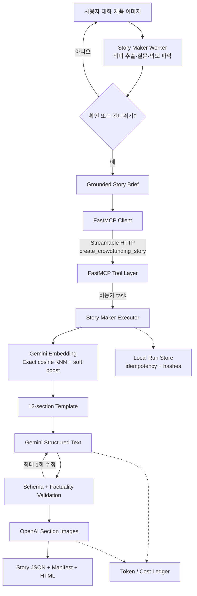

<p align="center">
  
</p>

<p align="center">
  <a href="https://www.python.org/"></a>
  <a href="https://docs.astral.sh/uv/"></a>
  <a href="https://gofastmcp.com/"></a>
  <a href="https://github.com/langchain-ai/langgraph"></a>
  <a href="https://github.com/pakyeon/funding-story-ai/actions/workflows/ci.yml"></a>
</p>

<p align="center">
  제품 대화와 이미지를 근거가 연결된 펀딩 스토리로 변환하고,<br>
  텍스트·섹션 이미지·편집 가능한 HTML을 하나의 검토 실행으로 만듭니다.
</p>

---

Funding Story AI는 하나의 거대한 프롬프트가 아닙니다. 대화 worker가 제품 정보를
의미 슬롯으로 정리하고, 명시적 확인 뒤 단 하나의 FastMCP 도구를 호출합니다. 실행기는
템플릿을 검색해 구조화 텍스트와 섹션 이미지를 만들고, 스키마·사실성 검사와 비용 원장을
통과한 결과만 실행 단위로 보존합니다.

[빠른 시작](#-빠른-시작) · [사용 사례](#-어떻게-사용할-수-있나요) ·
[아키텍처](#-아키텍처) · [구현 범위](#구현-범위) · [한계](#-현재-범위와-한계)

## 왜 Funding Story AI인가요?

- **사실 우선** — 사실, 메이커 진술, 증빙과 미확인 정보를 분리합니다.
- **대화형 입력** — 핵심 특장점·타깃·신뢰 정보가 부족하면 생성 전에 질문합니다.
- **명시적 생성 시작** — 확인 또는 건너뛰기 없이 worker가 실행기를 호출하지 않습니다.
- **검색 가능한 템플릿** — 설득 축과 섹션 골격을 임베딩하고 카테고리 soft boost로 재정렬합니다.
- **격리된 실행기** — 대화 에이전트는 생성 코드를 직접 실행하지 않고 MCP 계약만 사용합니다.
- **검토 가능한 산출물** — 브리프, 스토리, 이미지 manifest, HTML과 SHA-256을 한 run에 연결합니다.

## 🚀 빠른 시작

### 1. 설치

Python 3.12, [uv](https://docs.astral.sh/uv/)와 Vertex AI Application Default
Credentials가 필요합니다.

```bash
git clone https://github.com/pakyeon/funding-story-ai.git
cd funding-story-ai
uv sync --locked
cp .env.example .env
gcloud auth application-default login
```

`.env`에 `GOOGLE_CLOUD_PROJECT`, `OPENAI_API_KEY`와 각 공급자 비용 상한을 설정하세요.
비밀 키와 실행 산출물은 Git 추적에서 제외됩니다.

### 2. 데이터 계약 확인 — API 호출 없음

```bash
uv run funding-story validate
uv run ruff check .
uv run pytest
```

### 3. 직접 파이프라인 미리 보기 — API 호출 없음

```bash
uv run funding-story generate \
  --brief-path examples/robot-vacuum/brief.json \
  --category-profile robot-vacuum-ko-v1 \
  --dry-run
```

이 경로는 개발 편의를 위한 저수준 텍스트 파이프라인입니다. 설명 가능한 규칙 점수,
프롬프트 크기와 호출 비용 상한을 확인하지만 FastMCP와 임베딩 검색은 실행하지 않습니다.

### 4. 전체 실행 경로

터미널 1에서 loopback 전용 Streamable HTTP 서버를 시작합니다.

```bash
uv run funding-story server --host 127.0.0.1 --port 8765
```

터미널 2에서 구조화 브리프와 선택적 제품 이미지를 제출합니다.

```bash
uv run funding-story submit \
  --brief-path examples/robot-vacuum/brief.json \
  --reference-image examples/robot-vacuum/product-reference.png \
  --category-profile robot-vacuum-ko-v1 \
  --idempotency-key robot-vacuum-demo-v1 \
  --live
```

서버는 `artifacts/runs/run-…/` 아래에 다음 파일을 원자적 실행 단위로 만듭니다.

```text
brief.json
story.json
images/manifest.json
images/{section}.jpeg
preview.html
```

동일 caller·idempotency key·요청은 기존 run을 반환하고, 같은 키에 다른 요청을 넣으면
실패합니다.

### 5. 대화 worker 사용

worker는 입력 상태만 판단하고, 실제 생성은 위 MCP 서버에 위임합니다.

```python
import asyncio

from funding_story_ai import WorkerRequest, build_live_worker

worker = build_live_worker()
outcome = asyncio.run(
    worker.handle(
        WorkerRequest(
            input_id="robot-demo-01",
            initial_message=(
                "얇은 본체와 자동 먼지 비움이 강점인 로봇청소기입니다. "
                "가구 아래 반복 청소가 필요한 사용자를 위한 스토리를 만들고 싶어요."
            ),
        )
    )
)

print(outcome.status)
print(outcome.questions)
```

애플리케이션은 `semantic_state`와 대화 이력을 보존한 뒤 후속 답변과 상태 플래그를 다음
`WorkerRequest`에 전달합니다. `confirmed=True` 또는 `skip_requested=True`가 되기 전에는
MCP 생성 도구가 호출되지 않습니다.

## 🧹 포함된 사례: 합성 로봇청소기

<p align="center">
  
</p>

이 예제는 실제 판매 제품이나 펀딩 원문이 아닌 합성 데이터입니다.

| 입력 영역 | 예제 내용 | 시스템 처리 |
|---|---|---|
| 제품 사실 | 흡입력, 작동 시간, 물걸레·도크 사양 | 값과 source ID를 연결 |
| 사용자 문제 | 반복 청소와 청소 후 관리 부담 | 질문·검색 질의에 사용 |
| 증빙 | 합성 자체 시험 2건 | 외부 인증으로 표현하지 않음 |
| 미확인 | 가격, 배송일, 외부 인증, 보증 | 값을 만들지 않고 unknown 유지 |
| 결과 | 공통 역할 12개, 이미지 3개 | JSON·HTML·manifest와 경고 반환 |

예제 파일:

- [`brief.json`](examples/robot-vacuum/brief.json) — 입력 데이터 계약
- [`product-reference.png`](examples/robot-vacuum/product-reference.png) — 합성 제품 이미지
- [`robot-vacuum-ko-v1.json`](profiles/robot-vacuum-ko-v1.json) — 카테고리 질문 힌트

## 💡 어떻게 사용할 수 있나요?

### 대화에서 브리프로

제품 설명과 이미지에서 제품 정체성, 특장점, 타깃, 문제, 신뢰 근거와 팀 정보를
제품군 독립 슬롯으로 추출합니다. 이미지에서는 외형만 관찰하고 성능·인증·내부 구조를
추정하지 않습니다.

### 근거가 부족한 초기 기획

사용자가 “인증 없음”, “후기 없음”이라고 답하면 이를 누락이 아닌 명시적 답변으로
처리합니다. 미입력 가격·일정·정책은 생성하지 않고 검토 항목으로 남깁니다.

### 변경된 사양 반영

이전 값과 최신 확정 값이 충돌하면 생성 전에 최종 값을 묻습니다. 이미지가 폐기된
시제품이라면 텍스트를 권위값으로 사용하고 해당 이미지를 생성 참조에서 제외합니다.

### 템플릿 검색 실험

16개 후보 중 6개가 실행 가능한 12-section 템플릿입니다. 정확한 cosine KNN과
`0.0 / 0.1 / 0.2` 카테고리 boost를 독립적으로 시험할 수 있습니다. 나머지 10개는
검색 오선택을 드러내기 위한 동일 카테고리·교차 카테고리 negative입니다.

## 🏗 아키텍처



### 계층별 책임

| 계층 | 책임 | 하지 않는 일 |
|---|---|---|
| Worker | 멀티모달 의미 슬롯, 질문 분기, 확인, grounded brief | 템플릿·모델·이미지 직접 실행 |
| FastMCP | 1-tool allowlist, 입력 계약, task, 결과 resource, idempotency | 비즈니스 생성 로직 |
| Retriever | `gemini-embedding-001`, exact cosine KNN, category boost | 텍스트 생성 |
| Executor | 텍스트·이미지·HTML을 한 run으로 조립 | 대화 상태 관리 |
| Validator | 스키마, 수치, 미지원 주장, 출처 필드 검사 | 외부 세계의 진위 증명 |

상세 설계는 [`docs/architecture.md`](docs/architecture.md)에 있습니다.

## 구현 범위

| 기능 | 현재 구현 |
|---|---|
| 대화 입력 | Gemini 멀티모달 슬롯 추출 + LangGraph 질문·확인 |
| 생성 권한 | worker가 호출할 수 있는 FastMCP 도구 1개 |
| 전송 | FastMCP 3.x Streamable HTTP, loopback bind |
| 실행 추적 | caller-scoped idempotency, task, `story://runs/{run_id}` resource |
| 템플릿 | 설득 전략 6종, 공통 12-section 결과 골격 |
| 검색 | 16후보 exact KNN, 768차원, category soft boost |
| 텍스트 | Gemini 3.7 Flash 우선, 접근 실패 5회 뒤 3.6 Flash 폴백 |
| 검증 | JSON Schema, 입력 밖 수치·기능·일정·인증 패턴, 제한 수정 1회 |
| 이미지 | `gpt-image-2`, hero·solution·features, 섹션별 실패 격리 |
| 결과 | 브리프·스토리·이미지 manifest·HTML·SHA-256 |
| 비용 | 호출 전 상한 검사, Gemini/OpenAI 원장 분리 |

## 사실성 원칙

`automated_validation_passed`는 외부 사실이 참이라는 뜻이 아닙니다. 입력과 출력 사이의
충돌 및 알려진 무근거 확장 패턴을 찾지 못했다는 뜻입니다.

1. 사용자 진술과 외부 검증 증거를 구분합니다.
2. 이미지에서 보이지 않는 성능·인증·내부 구조를 추론하지 않습니다.
3. 미입력 가격·일정·후기·A/S를 만들지 않습니다.
4. 검증 경고나 이미지 실패가 있으면 run을 `partial`로 표시합니다.
5. 모든 결과는 `review_required: true`이며, 이미지 QA도 별도입니다.

## 검증 상태

- Python 3.12 + uv lock
- Ruff 통과
- pytest **68개 통과**
- JSON Schema 11개, 템플릿 6개, 검색 후보 16개 검증
- in-memory FastMCP task·resource·idempotency 계약 회귀 테스트
- 로봇청소기 profile 1개와 합성 입력 1세트

선행 로직 증류에서는 제한된 로봇청소기 질문 경로와 결과 구조를 비교했습니다. 2차
검증의 N09 holdout은 worker → MCP → 검색 → 실행기 경로를 끝까지 통과했지만, 기준
서비스가 확인으로 이동한 입력에서 실험용 로컬 재생기가 보조 질문을 한 불일치가
발견되었습니다. 이 저장소에서는 `explicitly-absent`를 답변 완료로 인정해 해당 분기를
보정했지만, 기준 서비스와의 전면 동등성을 뜻하지는 않습니다.

## 프로젝트 구조

```text
funding-story-ai/
├── src/funding_story_ai/
│   ├── worker.py             # 대화·의미 슬롯·grounded brief
│   ├── mcp_server.py         # FastMCP 1-tool 경계
│   ├── template_retrieval.py # embedding KNN + soft boost
│   ├── engine.py             # 통합 실행기
│   └── ...                   # 생성·검증·이미지·미리보기
├── schemas/                  # 공개 JSON 계약
├── templates/                # 템플릿 6개, catalog, retrieval index
├── profiles/                 # 카테고리별 질문 힌트
├── examples/                 # 합성·재현 가능 입력
├── docs/                     # 설계와 제한된 연구 요약
└── tests/                    # 외부 모델 호출 없는 회귀 테스트
```

## 📚 문서

- [아키텍처](docs/architecture.md)
- [템플릿·검색 시스템](docs/template-system.md)
- [사실성·검증](docs/factuality-and-validation.md)
- [제품군 프로필](docs/category-profiles.md)
- [관찰 가능한 Story AI 동작](docs/research/observable-story-ai-behavior.md)
- [PoC 평가 요약](docs/research/poc-evaluation-summary.md)
- [현재 한계](docs/research/limitations.md)

## ⚠️ 현재 범위와 한계

- 질문·품질 검증은 한국어 로봇청소기에 한정됩니다.
- CLI는 제공하지만 대화 상태를 보존하는 웹 UI는 없습니다.
- 로컬 run store는 단일 프로세스 개발용이며 인증·다중 사용자 격리를 제공하지 않습니다.
- 16개 후보는 검색 로직 검증용 축소 집합이며 운영 검색 품질을 대표하지 않습니다.
- 템플릿 구조와 실제 펀딩 성과 사이의 인과 관계를 주장하지 않습니다.
- 외부 사실 검색, 광고 심사, 권리 검토는 연결하지 않았습니다.
- 모델 가격과 비용 원장은 추정치이며 실제 Billing과 다를 수 있습니다.
