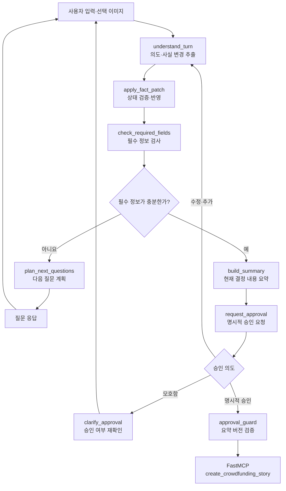

# 적응형 story-maker-worker 설계

- 상태: 핵심 worker와 별도 Streamlit 브랜치 반영 완료
- 대상: 사용자 입력부터 FastMCP 생성 도구 호출 직전까지
- 목표: 단순 규칙형 대화 처리를 세션 상태를 가진 적응형 LangGraph 대화 처리기로 교체

## 1. 문서 목적

변경 전 `story-maker-worker`는 LLM으로 의미 상태와 다음 질문을 생성하지만, 호출자가 이전
상태와 대화 내역을 다시 전달해야 하는 요청 단위 처리에 가깝다. 질문 완료와 생성 확인도
제한된 플래그와 규칙을 중심으로 제어한다.

새 설계는 다음 사용자 흐름을 하나의 세션 상태 그래프로 관리한다.

```text
질문 → 정보 보완 → 현재 결정 내용 요약 → 사용자 승인 → 스토리 생성
```

목표는 확인할 수 없는 외부 서비스의 비공개 노드나 프롬프트를 추정해 복제하는 것이
아니다. 관찰된 사용자 경험과 안전 경계를 유지하면서, 입력 수정과 문맥 변화에 대응할 수
있는 독립적인 MVP를 만드는 것이다.

## 2. 근거와 설계 판단

### 2.1 관찰을 통해 확인한 동작

- 사용자가 최초 입력에서 바로 생성을 요청해도 부족한 핵심 정보를 다시 확인할 수 있다.
- 후속 질문은 제품군과 입력 정보에 따라 표현, 순서와 묶음이 달라질 수 있다.
- 생성 직전에는 지금까지 결정된 내용을 요약해 보여준다.
- 사용자가 요약 내용을 확인한 뒤 생성 여부를 명시적으로 결정한다.
- 질문 건너뛰기와 생성 승인은 서로 다른 행위다.
- 현재 관찰 범위에는 사용자 확인 없이 시작되는 자동 생성 분기가 없다.

### 2.2 이 프로젝트의 설계 판단

- 질문 선택, 답변 해석, 정보 수정, 요약과 승인 의도 분류는 LLM이 담당한다.
- 필수 정보 충족 여부, 상태 적용, 승인 버전 검증과 도구 호출 허용은 결정적 규칙이
  담당한다.
- 현재 펀딩의 확정 정보는 의미 검색 결과가 아니라 구조화된 그래프 상태를 기준으로 한다.
- 세션 상태는 LangGraph Checkpointer로 저장한다.
- 초기 MVP에는 별도의 에이전트 메모리 프레임워크와 장기 메모리를 도입하지 않는다.

이 구분은 관찰된 외부 동작과 프로젝트 내부 구현 선택을 동일한 사실로 표현하지 않기
위한 것이다.

## 3. 설계 원칙

1. 사용자가 제공하지 않은 제품 정보는 확정 사실로 만들지 않는다.
2. 필수 필드의 존재 여부만 결정적 규칙으로 검사한다.
3. 질문 내용과 질문 순서는 현재 대화, 누적 사실과 이미 물어본 주제를 바탕으로 LLM이
   결정한다.
4. 사용자의 최신 수정 요청은 이전 값보다 우선한다.
5. 요약 이후 정보가 변경되면 기존 승인은 무효화한다.
6. 현재 요약에 대한 명시적 승인 없이는 생성 도구를 호출하지 않는다.
7. 최초 메시지의 생성 요청, 질문 건너뛰기와 생성 제안은 최종 승인이 아니다.
8. 대화 기록과 생성에 사용하는 확정 사실을 서로 다른 상태로 관리한다.
9. 장기 개인화보다 현재 펀딩 세션의 일관성과 복구 가능성을 우선한다.

## 4. 목표 실행 흐름



LangGraph는 질문, 보완, 요약과 승인 상태 전이를 관리한다. 템플릿 검색, 본문·이미지
생성, 검증과 HTML 렌더링은 기존 `story-maker` 실행기의 책임으로 유지한다.

## 5. 그래프 상태

초기 상태 계약은 다음 책임을 표현해야 한다. 실제 클래스와 필드명은 구현 시 Pydantic
모델과 `TypedDict`로 확정한다.

```python
class StoryWorkerState(TypedDict):
    messages: list[BaseMessage]

    facts: dict[str, FactValue]
    fact_history: list[FactChange]
    missing_required_fields: list[str]

    asked_topics: list[str]
    current_question_plan: list[str]

    current_summary: StorySummary | None
    summary_version: int

    workflow_stage: str
    approval_pending: bool
    approved_summary_version: int | None
```

### 5.1 대화 기록과 확정 사실

`messages`는 사용자 표현, 지시 대상과 대화 흐름을 이해하기 위한 기록이다. `facts`는
질문 판단, 요약과 최종 생성 입력에 사용하는 현재 펀딩의 기준 정보다. 최종 생성은 오래된
대화 원문을 다시 추론하는 대신 승인된 구조화 사실과 요약을 사용한다.

### 5.2 사실 상태

각 사실은 최소한 다음 정보를 포함한다.

- 필드와 현재 값
- 값을 제공한 사용자 메시지 또는 선택 이미지
- `confirmed`, `inferred`, `unknown` 등 정보 상태
- 현재 값인지 이전 값에 의해 대체됐는지 여부
- 마지막 변경 턴
- 스토리 생성 입력에 사용할 수 있는지 여부

LLM이 `FactPatch`를 제안하고 결정적 reducer가 허용된 연산과 스키마를 검증해 적용한다.
사용자가 이전 답변을 수정하면 이전 값은 기록에서 지우지 않고 `superseded`로 남기며,
현재 요약에는 최신 유효 값만 반영한다.

## 6. 노드 책임

| 노드 | 입력 | 출력 | 판단 방식 |
|---|---|---|---|
| `understand_turn` | 최근 입력, 대화, 현재 사실 | 의도, 사실 변경안, 확인 필요 항목 | LLM |
| `apply_fact_patch` | 사실 변경안, 현재 사실 | 검증된 최신 사실과 변경 이력 | 규칙 |
| `check_required_fields` | 최신 사실 | 누락 필수 필드 | 규칙 |
| `plan_next_questions` | 사실, 누락 필드, 질문 이력, 최근 대화 | 질문 주제·순서·표현 | LLM |
| `build_summary` | 최신 사실과 미확인 상태 | 생성 전 사용자 확인용 요약 | LLM |
| `classify_approval` | 승인 요청과 사용자 응답 | 승인·수정·거절·모호함 | LLM |
| `approval_guard` | 현재·승인 요약 버전, 상태 | MCP 호출 허용 여부 | 규칙 |

### 6.1 `understand_turn`

자유 텍스트가 아니라 구조화 출력을 반환한다.

```json
{
  "intent": "provide_information",
  "fact_patches": [
    {
      "field": "target_customer",
      "operation": "replace",
      "value": "20~40대 반려동물 가구",
      "source_message_id": "message-08"
    }
  ],
  "unresolved_references": [],
  "requires_clarification": false
}
```

이 노드는 변경안을 제안할 뿐 상태를 직접 덮어쓰지 않는다. 필드 이름, 연산 유형과 값
형식은 `apply_fact_patch`가 다시 검증한다.

### 6.2 `plan_next_questions`

LLM에는 다음 정보를 제공한다.

- 현재까지 확인된 사실
- 규칙 검사에서 확인한 누락 필수 필드
- 이미 질문한 주제와 사용자가 건너뛴 선택 주제
- 최근 대화와 해소되지 않은 지시 대상
- 한 턴에 허용할 질문 수

LLM은 현재 맥락에 따라 관련 항목을 한 질문으로 묶거나 순차 질문을 선택할 수 있다.
다만 필수 필드가 채워졌는지 여부는 LLM이 최종 결정하지 않는다.

### 6.3 `build_summary`

요약은 생성할 스토리의 초안이 아니라 사용자가 제공한 결정 사항의 확인 화면이다.
확정 사실, 미확인 정보와 생성에 반영하지 않을 추정을 구분한다. 요약이 새로 만들어지거나
사실이 변경되면 `summary_version`이 증가한다.

### 6.4 `classify_approval`과 `approval_guard`

승인 분류는 자연어 의미가 필요하므로 LLM이 수행한다. 다음 규칙 검사는 결정적으로
수행한다.

- 현재 `summary_version`과 사용자가 본 요약 버전이 같은가
- 요약 이후 사실 변경이 없었는가
- 응답이 명시적 승인으로 분류됐는가
- 동일 세션에서 승인된 입력만 도구 요청으로 변환되는가

모호한 표현은 생성으로 진행하지 않고 승인 여부를 다시 묻는다.

## 7. 세션 상태와 Checkpointer

초기 MVP는 LangGraph Checkpointer만 사용한다.

- 대화 시작 시 세션별 UUID를 `thread_id`로 발급한다.
- 동일한 대화의 모든 그래프 호출은 같은 `thread_id`를 사용한다.
- 로컬 Streamlit 재실행과 프로세스 재시작을 고려해 SQLite Checkpointer를 기본으로
  검토한다.
- 체크포인트 파일은 Git에서 제외한다.
- 새 대화는 새 `thread_id`로 시작한다.
- 완료·취소된 세션은 삭제하거나 만료할 수 있도록 저장소 경계를 둔다.
- 사용자·브랜드·프로젝트 사이에 기억을 공유하지 않는다.

Checkpointer는 그래프 상태와 중단 지점을 저장한다. 현재 펀딩 정보의 의미와 충돌 해결
규칙까지 대신하지는 않으므로 구조화 상태와 reducer는 별도로 유지한다.

### 7.1 초기 MVP에서 메모리 프레임워크를 제외하는 이유

현재 요구사항은 여러 세션에서 정보를 검색하는 장기 개인화보다 한 세션의 정확한 상태
전이와 승인 복구에 가깝다. 별도 메모리 프레임워크를 먼저 도입하면 사실 추출 중복,
저장·검색 지연과 확정 정보의 기준이 불분명해질 수 있다.

다음 요구가 실제로 생기면 별도 단계에서 재검토한다.

- 여러 펀딩에서 같은 메이커·브랜드 정보를 재사용해야 하는 경우
- 사용자 선호를 세션 사이에서 기억해야 하는 경우
- 여러 에이전트가 같은 기억을 공유해야 하는 경우
- 다수의 과거 프로젝트를 의미 검색해야 하는 경우

도입하더라도 Checkpointer는 현재 세션과 워크플로 상태를, 구조화된 프로젝트 상태는
확정 사실을, 메모리 프레임워크는 선택적 장기 기억을 담당하도록 경계를 분리한다.

### 7.2 대화 요약 도입 기준

초기에는 전체 세션 메시지를 유지한다. 실제 입력 토큰과 대화 길이 평가에서 문맥 한계가
확인될 때만 오래된 메시지를 요약한다.

- 확정 사실과 승인 상태는 요약하지 않고 구조화 상태에 유지한다.
- 최근 대화와 해결되지 않은 수정 요청은 원문을 유지한다.
- 오래된 표현과 반복 대화만 실행 입력에서 요약할 수 있다.
- 요약 적용 여부와 임계값은 고정 턴 수가 아니라 토큰 측정 결과로 결정한다.

## 8. 프롬프트 원칙

모든 LLM 노드는 Pydantic 또는 JSON Schema 기반 구조화 출력을 사용한다. 공통 지침은
다음과 같다.

- 사용자가 명시하지 않은 사실을 임의로 확정하지 않는다.
- 이전 대화보다 사용자의 최신 명시적 수정 요청을 우선한다.
- 이미 해소된 질문을 반복하지 않는다.
- 질문 수를 채우기보다 생성에 필요한 정보 확보를 목표로 한다.
- 질문 예시와 모델의 제안은 사용자 사실로 저장하지 않는다.
- 생성 제안, 질문 건너뛰기와 최종 승인을 구분한다.
- 불명확한 지시 대상이나 상충 정보는 추정하지 않고 확인한다.

노드별 프롬프트는 하나의 거대한 시스템 프롬프트로 합치지 않는다. 사실 추출, 질문 계획,
요약과 승인 분류의 입출력 계약을 분리해 개별 평가와 교체가 가능하게 한다.

## 9. 평가 설계

### 9.1 평가 데이터셋

기존 WAi Distillation 입력과 관찰 응답을 가능한 범위에서 기준 사례로 재사용하고, 다음
합성 시나리오를 추가한다.

- 최초 입력만으로 필수 정보가 충분한 경우
- 필수 정보가 하나 또는 여러 개 부족한 경우
- 사용자가 이전 답변의 일부를 수정하는 경우
- 서로 모순되는 정보를 제공하는 경우
- 이미 답한 질문을 다른 표현으로 다시 묻기 쉬운 경우
- 사용자가 바로 생성을 요청하지만 필수 정보가 부족한 경우
- 요약 이후 일부 사실만 수정하는 경우
- 명확한 승인, 거절과 모호한 표현
- 승인 후 정보를 변경하는 경우
- 관련 없는 질문이나 일시적인 주제 전환 뒤 원래 흐름으로 돌아오는 경우
- 이미지 관찰과 사용자 텍스트가 충돌하는 경우

### 9.2 노드별 평가 지표

| 평가 대상 | 주요 지표 |
|---|---|
| 입력 이해 | 사실 추출 정확도, 수정·충돌 감지율 |
| 필수 정보 검사 | 누락 탐지 재현율, 잘못된 누락 판정률 |
| 질문 계획 | 관련성, 중복률, 맥락 반영, 질문 묶음 적절성 |
| 상태 갱신 | 최신 값 반영률, 폐기 값 재사용률 |
| 요약 | 입력 충실도, 누락률, 환각 현상 발생률 |
| 승인 분류 | 오승인율, 모호한 승인 차단율 |
| 상태 전이 | 허용되지 않은 전이와 반복 전이 발생률 |
| 도구 경계 | 승인 없는 MCP 호출 횟수 |

승인 판별에서는 평균 정확도보다 잘못된 승인 허용 0회를 우선한다.

### 9.3 전체 흐름 평가

- 필수 정보가 충분해진 뒤 요약 단계에 도달하는 비율
- 동일 정보를 반복 질문하지 않고 완료한 비율
- 수정된 사실만 최종 요약과 생성 입력에 반영한 비율
- 생성까지 필요한 대화 턴 수
- 중단·재개 이후 같은 상태를 복구한 비율
- 명시적 승인 전 MCP 호출 0회

## 10. 구현 순서

1. 현재 규칙 기반 구현과 WAi 관찰 자료를 회귀 기준으로 동결한다.
2. 그래프 상태, `FactPatch`, 요약과 승인 Pydantic 계약을 확정한다.
3. `understand_turn`, reducer와 필수 필드 검사부터 구현한다.
4. 질문 계획, 요약과 승인 분류 노드를 구현한다.
5. 조건부 edge와 승인 버전 guard를 연결한다.
6. SQLite Checkpointer와 세션 `thread_id` 수명주기를 구현한다.
7. 승인된 상태만 기존 brief builder와 FastMCP 요청으로 변환한다.
8. 노드별 평가 데이터셋과 단위 테스트를 작성한다.
9. 중단·재개, 수정·재승인과 MCP 차단 통합 테스트를 수행한다.
10. 핵심 worker가 안정된 뒤 별도 Streamlit 브랜치에 세션 UI를 반영한다.
11. 실제 토큰과 대화 길이를 측정한 뒤 메시지 요약 필요성을 다시 판단한다.

## 11. Streamlit 반영 원칙

- `thread_id`는 Streamlit 세션에 보관한다.
- 제품 이미지와 텍스트는 같은 사용자 대화 입력으로 처리한다.
- 현재 수집된 정보와 생성 직전 요약을 사용자가 확인할 수 있게 한다.
- 수정된 정보는 동일 그래프 세션으로 전달한다.
- 승인 전에는 생성 실행을 허용하지 않는다.
- 승인한 요약과 실제 생성에 사용한 요약 버전을 결과에서 확인할 수 있게 한다.
- 내부 프롬프트, 모델 원시 출력과 개발 상태는 기본 화면에 노출하지 않는다.

Streamlit 코드는 핵심 worker와 분리된 브랜치에서 유지한다. 핵심 상태·그래프·테스트는
`main`에 반영하고 UI는 해당 공개 계약만 사용한다.

## 12. 초기 MVP 제외 범위

- 사용자·브랜드 단위 장기 메모리
- 여러 펀딩 프로젝트 사이의 자동 정보 재사용
- Mem0 또는 LangMem 기반 장기 기억
- 벡터 기반 대화 기억 검색
- 사용자 승인 없는 자동 생성
- 승인 전 MCP 실행
- 장기 개인화와 브랜드 선호 학습
- 운영용 분산 Checkpointer

## 13. 완료 기준

다음 조건을 모두 만족하면 적응형 worker 초기 MVP 구현이 완료된 것으로 본다.

1. 질문, 보완, 요약과 승인 단계가 하나의 `thread_id` 상태로 이어진다.
2. 사용자의 수정 사항이 이전 값을 대체하고 최종 요약에 반영된다.
3. 필수 필드 검사는 결정적이며 질문 표현과 순서는 LLM이 결정한다.
4. 이미 해소된 질문을 불필요하게 반복하지 않는다.
5. 요약 이후 사실이 바뀌면 기존 승인이 무효화된다.
6. 모호한 승인 표현은 MCP 호출로 이어지지 않는다.
7. 승인된 요약 버전과 현재 버전이 같을 때만 생성 도구를 호출한다.
8. Checkpointer를 통해 대화 중단 지점과 상태를 복구한다.
9. 노드별 평가와 전체 흐름 회귀 테스트가 자동화되어 있다.
10. 승인 없는 MCP 호출이 모든 평가에서 0회다.

## 14. 관련 문서

- [현재 구현 아키텍처](./architecture.md)
- [관찰 가능한 Story AI 동작](./research/observable-story-ai-behavior.md)
- [구성 양식과 검색](./template-system.md)
- [입력 근거와 검증](./factuality-and-validation.md)
- [PoC Logic Distillation 요약](./research/poc-logic-distillation-summary.md)
- [적응형 worker 평가 결과](./adaptive-conversation-worker-evaluation-results.md)
