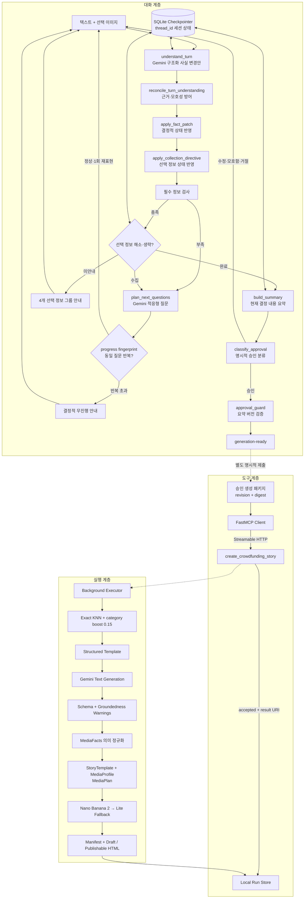

# 아키텍처

Funding Story AI는 대화 처리기, MCP 도구 경계와 스토리 실행기를 분리한다. 대화
처리기는 질문과 생성 승인을 다루고, 실행기는 대화 상태 없이 구조화 입력만 처리한다.



## 공개 구조와의 대응

| 공개된 역할 | 이 저장소 | 구현 내용 |
|---|---|---|
| story-maker-worker | `conversation.py`, `worker.py` | 사실 추출·필수·선택 정보 수집·요약·승인·`generation-ready` |
| MCP tool layer | `mcp_server.py` | worker용 생성 도구, 비동기 접수, 결과 리소스 |
| story-maker executor | `engine.py` | 텍스트·이미지·HTML 통합 실행 |
| template search | `template_retrieval.py` | Gemini embedding exact KNN + soft boost |
| text generation | `pipeline.py`, `adapter.py` | JSON Schema 제약 Gemini 결과 |
| media planning | `semantic_normalization.py`, `media_planning.py` | 능력군 정규화, 동적 슬롯·참조·배치 계획 |
| image generation | `image_generation.py`, `image_pipeline.py` | Nano Banana 폴백, 독립 슬롯 실행, AI 표시, 검토 상태 |
| callback / result | `run_store.py` | 로컬 리소스와 멱등 재조회 |

상위 supervisor는 여러 도메인 라우팅용이므로 단일 스토리 범위에서 구현하지 않았다.
이 표는 공개된 책임 경계의 대응이며 비공개 클래스, payload, 배포 구조와 동일하다는
주장이 아니다.

## 대화 처리기

`StoryWorkerState`는 다음을 세션별로 기록한다.

- 사용자·처리기 메시지와 선택 이미지 위치
- 제품명·유형·분류, 강점, 대상, 문제, 신뢰·팀 정보 등 구조화 사실
- 사실 변경 이력, 출처 메시지와 현재 사실 revision
- 필수 누락 필드와 선택 정보의 안내·요청·해소·생략 상태
- 질문 목적·세부 요청·기준 revision·해소 여부와 현재 질문 계획
- 질문 signature, progress fingerprint와 무진행 선택 안내 횟수
- 현재 요약, 요약 버전, 요약을 만든 사실·수집 revision
- 승인 대기 여부, 승인된 요약 버전과 실행 단계

각 사실은 `provided`, `explicitly-absent`, `unknown` 중 하나다. LLM은 사실 변경안을
제안하지만 허용 필드와 연산 적용, 필수 정보 검사와 승인 버전 검증은 결정적 노드가
담당한다. 선택 정보는 네 그룹으로 안내하며 질문당 같은 그룹의 최대 3개만 허용한다.
질문 표현과 묶음은 현재 대화와 누적 사실을 받은 LLM이 결정하고, 후보·그룹·반복 여부는
규칙이 다시 검증한다.

LLM 출력은 곧바로 사실 상태가 되지 않는다. 병합 방어가 경쟁 제품을 사용자 제품 유형으로
채우는 패치, 필드명이 없는 대명사 수정, 대상 없는 `알아서 해줘` 같은 수집 지시를 차단하거나
명확화로 바꾼다. 반대로 사실·날짜·모호한 참조가 없는 순수 생성 요청은 모호함으로 보지
않고 필수 정보 수집으로 연결한다. 같은 사실·수집·요약 revision에서 동일 질문은 한 번만
재표현할 수 있고, 이후에는 LLM을 다시 호출하지 않는 무진행 안내로 전환한다.

LangGraph 그래프와 SQLite Checkpointer가 같은 `thread_id`의 질문, 보완, 요약과 승인
상태를 유지한다. 사용자는 자연어로 승인·수정·거절할 수 있으며, 불리언 승인 플래그와
질문 건너뛰기 생성 경로는 없다. 사실이나 선택 정보 수집 상태가 바뀌면 기존 승인은
무효화된다.

429·5xx·시간 초과와 전송 오류는 제한된 지수 백오프와 jitter로 재시도한다. 제품 런타임은
설정된 폴백을 사용할 수 있지만 평가는 폴백을 끈다. 구조화 출력은 한 번만 교정하며 요약은
스키마뿐 아니라 현재 사실·생략 상태 일치와 근거 없는 수치도 검증한다. 재시도 또는 교정이
모두 실패하면 현재 세션 revision을 유지하고 `temporary_error`와 재시도 안내를 반환하며,
승인이나 `generation-ready`로 이동하지 않는다.

대화 worker는 승인된 상태를 `generation-ready`로 반환하고 자동으로 MCP를 호출하지 않는다.
별도 `StoryGenerationDispatcher`가 같은 revision의 승인 요약, 입력 근거 스토리 명세,
worker fact 상태와 source/evidence/asset catalog를 immutable 생성 패키지로 투영한다.
MCP 경계는 canonical digest, revision과 참조 무결성을 LLM 호출 전에 다시 검증한다.

입력은 메시지당 1,000자 이하, 선택 이미지 1개·10MB 이하·JPG/PNG/WEBP로 제한한다.

## FastMCP 경계

- 전송: Streamable HTTP
- 기본 bind: `127.0.0.1:8765`
- 별도 생성 dispatcher 허용 목록: `create_crowdfunding_story` 1개
- 제출 응답: `accepted`, 실행 ID, `story://runs/{run_id}`
- 실행: 로컬 thread pool 백그라운드 작업
- 멱등성: caller ID + idempotency key + canonical request hash

running, completed, failed 재요청은 예외 대신 동일 실행 상태를 반환한다. 같은 키와 다른
payload만 충돌이다. 로컬 구현은 webhook이 아니라 결과 리소스 조회를 사용한다.

## 검색·실행·결과

```text
Gemini embedding (RETRIEVAL_DOCUMENT / RETRIEVAL_QUERY, 768d)
→ L2 normalize
→ exact cosine similarity
→ same-category boost (기본 0.15)
→ candidate ID tie break
→ 순위상 첫 실행 가능 템플릿
```

현재 index 16개 중 6개가 실행 가능하다. 선택된 구성 양식은 10~13개 영역의 설득 흐름을
정의하고, 이미지 수는 로봇청소기 미디어 프로필과 승인 사실을 결합한 `MediaPlan`이
동적으로 정한다. 동일 설득 목적은 한 슬롯으로 묶고 절대 상한은 8개다.

제품 외형 슬롯에는 해당 역할의 제공 참조 자산만 전달하고, 문제 상황·차트처럼 제품이 없는
장면에는 참조 이미지를 강제하지 않는다. 슬롯끼리 생성 이미지를 연쇄 참조하지 않는다.
이미지는 Nano Banana 2를 최초 호출과 1회 재시도까지 사용하고, 실패 시 Nano Banana 2
Lite를 1회 호출한다. 권한·잘못된 요청·안전 정책 거부는 반복하지 않는다. 성공 이미지는
외형·문구·새 주장·장면 중복의 사람 검토 상태를 manifest에 남긴다.

결과는 `brief.json`, `story.json`, `media-facts.json`, `media-plan.json`, 이미지 manifest와
파일, `draft.html` 및 조건부 `publishable.html`과 SHA-256을 포함한다. HTML은 740px 본문과
768px 모바일 전환점을 사용하며 내부 검증 도구막대나 출처 패널을 표시하지 않는다.

## 의도적으로 다른 부분

- 본문 모델은 PoC 비용 결정에 따라 Gemini 3.7 Flash와 3.6 Flash를 사용한다.
- 전송은 FastMCP 권장 Streamable HTTP를 사용하고 SSE 폴백은 구현하지 않았다.
- 로컬 callback 대체는 polling resource이며 운영 webhook payload를 재현하지 않는다.
- 생성 dispatcher가 보는 도구가 하나라는 사실은 전체 MCP 서버 도구 수에 대한 주장이 아니다.
- 세션 메모리는 로컬 SQLite Checkpointer를 사용하며 장기 사용자 메모리는 구현하지 않았다.
