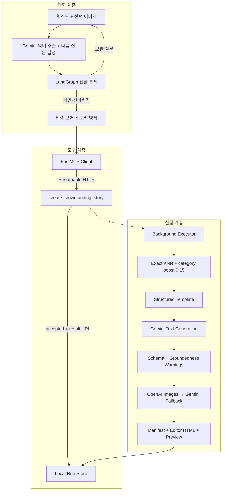

# 아키텍처

Funding Story AI는 대화 처리기, MCP 도구 경계와 스토리 실행기를 분리한다. 대화
처리기는 질문과 생성 승인을 다루고, 실행기는 대화 상태 없이 구조화 입력만 처리한다.



## 공개 구조와의 대응

| 공개된 역할 | 이 저장소 | 구현 내용 |
|---|---|---|
| story-maker-worker | `worker.py` | 의미 상태와 다음 질문 결정, 확인, 명세 작성 |
| MCP tool layer | `mcp_server.py` | worker용 생성 도구, 비동기 접수, 결과 리소스 |
| story-maker executor | `engine.py` | 텍스트·이미지·HTML 통합 실행 |
| template search | `template_retrieval.py` | Gemini embedding exact KNN + soft boost |
| text generation | `pipeline.py`, `adapter.py` | JSON Schema 제약 Gemini 결과 |
| image generation | `image_generation.py`, `image_pipeline.py` | 공급자 폴백, 재시도, AI 표시, 검토 상태 |
| callback / result | `run_store.py` | 로컬 리소스와 멱등 재조회 |

상위 supervisor는 여러 도메인 라우팅용이므로 단일 스토리 범위에서 구현하지 않았다.
이 표는 공개된 책임 경계의 대응이며 비공개 클래스, payload, 배포 구조와 동일하다는
주장이 아니다.

## 대화 처리기

`story-intake-semantic-state-v2`는 다음을 함께 기록한다.

- 언어와 이미지 첨부 여부
- 제품명·유형·분류, 강점, 대상, 문제, 신뢰·팀 정보
- 리워드, 일정·정책, 펀딩금 계획, 플랫폼 선택 이유, 위험 대응
- 값 충돌 상태
- `ready_to_confirm`, 다음 질문, 질문 대상 필드

각 슬롯은 `provided`, `explicitly-absent`, `unknown` 중 하나다. 질문 순서는 별도 제품
프로필이나 UI 완료 표시가 아니라 LLM이 현재 대화에서 결정한다. LangGraph는 시작,
보완 질문, 확인, 생성 준비의 전환만 통제한다.

입력은 메시지당 1,000자 이하, 선택 이미지 1개·10MB 이하·JPG/PNG/WEBP로 제한한다.

## FastMCP 경계

- 전송: Streamable HTTP
- 기본 bind: `127.0.0.1:8765`
- worker 허용 목록: `create_crowdfunding_story` 1개
- 제출 응답: `accepted`, 실행 ID, `story://runs/{run_id}`
- 실행: 로컬 thread pool 백그라운드 작업
- 멱등성: caller ID + idempotency key + canonical request hash

running, completed, failed 재요청은 예외 대신 동일 실행 상태를 반환한다. 같은 키와 다른
payload만 충돌이다. 로컬 구현은 webhook이 아니라 결과 리소스 조회를 사용한다.

## 검색·실행·결과

```text
Gemini embedding (RETRIEVAL_DOCUMENT / RETRIEVAL_QUERY, 768d)
→ L2 normalize
→ exact cosine similarity
→ same-category boost (기본 0.15)
→ candidate ID tie break
→ 순위상 첫 실행 가능 템플릿
```

현재 index 16개 중 6개가 실행 가능하다. 선택된 구성 양식은 10~13개 영역과 5~6개
이미지 위치를 직접 정의한다. 본문 검증 경고는 전체 재생성을 유발하지 않는다.

이미지는 OpenAI 키가 있으면 `gpt-image-2`를 먼저 사용하고 Gemini 이미지 모델로
폴백한다. 각 공급자는 최대 3회 시도한다. 성공 이미지는 사람 검토 전에도 미리보기에
표시하되 `pending`을 명시한다. PNG tEXt 또는 JPEG COM에 AI 생성 표시를 넣을 수 없는
비정상 바이트는 표시 실패를 manifest에 기록한다.

결과는 `brief.json`, `story.json`, 이미지 manifest와 파일, `editor.html`,
`preview.html` 및 SHA-256을 포함한다. `editor.html`은 보수적인 Froala 계열 편집기용
조각이지만 비공개 와디즈 허용 목록과의 완전한 호환을 보증하지 않는다.

## 의도적으로 다른 부분

- 본문 모델은 PoC 비용 결정에 따라 Gemini 3.7 Flash와 3.6 Flash를 사용한다.
- 전송은 FastMCP 권장 Streamable HTTP를 사용하고 SSE 폴백은 구현하지 않았다.
- 로컬 callback 대체는 polling resource이며 운영 webhook payload를 재현하지 않는다.
- worker가 보는 도구가 하나라는 사실은 전체 MCP 서버 도구 수에 대한 주장이 아니다.
