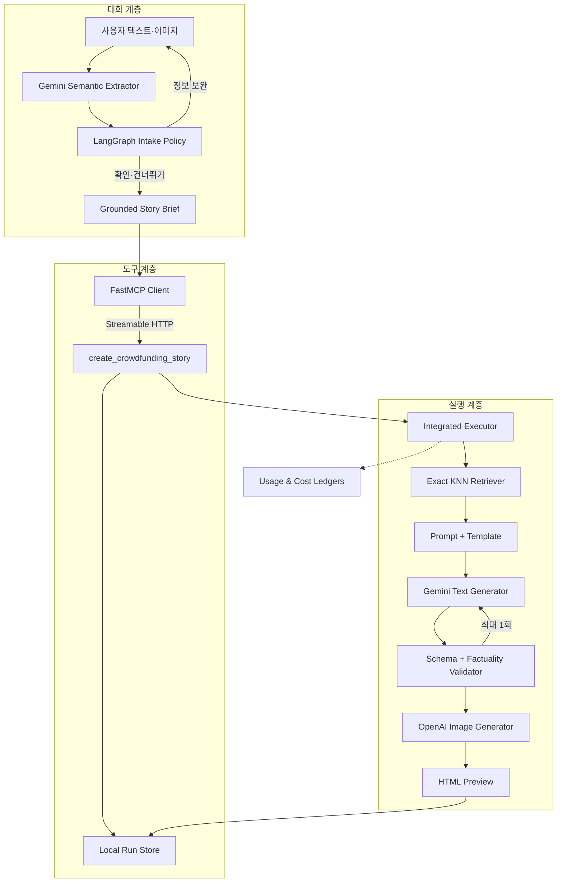

# 아키텍처

Funding Story AI는 대화 에이전트, 도구 경계와 생성 실행기를 분리한다. worker는 사용자
의도를 이해하지만 생성 코드를 직접 실행할 수 없고, executor는 스토리를 생성하지만
대화 상태를 알지 못한다. 두 계층은 FastMCP의 단일 구조화 도구로만 연결된다.

## 전체 흐름



## 공개 구조와의 대응

공개된 상위 구조에서 story-maker-worker, MCP tool layer, story-maker executor와
텍스트·이미지 생성으로 분리된 책임을 제품 구조에 대응했다. 상위 도메인 supervisor는
여러 도메인을 라우팅할 때 필요한 요소이므로 단일 스토리 제품에는 포함하지 않았다.

| 공개된 역할 | 이 저장소 | 구현 상태 |
|---|---|---|
| story-maker-worker | `worker.py` | 의미 슬롯, 질문, 확인, grounded brief |
| MCP tool layer | `mcp_server.py` | FastMCP 3.x, tool 1개, task·resource |
| story-maker executor | `engine.py` | 텍스트·이미지·HTML 통합 실행 |
| template search | `template_retrieval.py` | Gemini embedding exact KNN + boost |
| text generation | `pipeline.py`, `adapter.py` | schema-constrained Gemini 결과 |
| image generation | `image_pipeline.py` | 섹션 3개, 실패 격리, QA 상태 |
| callback / result | `run_store.py` | local resource와 idempotent replay |

이는 관찰 가능한 책임 경계를 재현한 것이며 외부 서비스의 비공개 클래스·payload·배포
구조와 동일하다는 주장이 아니다.

## Worker

worker는 다음 제품군 독립 슬롯을 추출한다.

```text
product_identity
key_strengths
target_supporters
problem_context
trust_elements
maker_team_intro
```

각 슬롯은 `provided`, `explicitly-absent`, `unknown` 중 하나다. 신뢰 정보나 팀 정보가
“없음”으로 명시되면 답변 완료로 인정한다. 충돌이 해소되지 않았거나 제품 정체성이
없으면 실행 도구를 호출하지 않는다.

LangGraph 입력 그래프는 최소 보완 질문 → 확인 → 생성 준비 순서만 제어한다. 제품군별
예시는 profile에 있고 라우팅 코어에는 제품명이 들어가지 않는다.

## FastMCP 경계

- 전송: Streamable HTTP
- 기본 bind: `127.0.0.1:8765`
- worker allowlist: `create_crowdfunding_story` 1개
- 실행: FastMCP task
- 결과: `story://runs/{run_id}` resource
- 중복 제어: caller ID + idempotency key + canonical request hash

SSE fallback은 구현하지 않았다. local server는 loopback 이외 주소로 시작할 수 없다.
운영 배포 시에는 인증, TLS, 공유 저장소와 다중 프로세스 동시성 제어가 별도 필요하다.

## 템플릿 검색

검색 문서는 카테고리, 제품 유형, 문제, 타깃, 핵심 메시지, 설득 축, 톤과 섹션 역할을
직렬화한다. 브리프도 같은 의미 영역의 질의로 변환한다.

```text
Gemini embedding (RETRIEVAL_DOCUMENT / RETRIEVAL_QUERY, 768d)
→ L2 normalize
→ exact cosine similarity
→ same-category boost (0.0, 0.1, 0.2 중 하나)
→ deterministic candidate-id tie break
→ executable top-1
```

현재 index는 16후보이고 6후보만 실제 템플릿을 가리킨다. 실행 불가능 candidate가
top-1이면 조용히 다음 후보로 넘어가지 않고 `NonExecutableTopResult`로 실패한다.

## 실행기와 결과 계약

통합 실행기는 다음 순서로 한 run을 소유한다.

1. 브리프 검증
2. 템플릿 검색 또는 명시적 템플릿 적용
3. 구조화 스토리 생성 및 최대 1회 수정
4. hero·solution·features 이미지 생성
5. 편집 가능한 HTML 렌더링
6. 각 파일 SHA-256과 비용·QA 요약 기록

이미지 한 장의 실패나 스토리 경고는 다른 산출물을 삭제하지 않는다. 대신 run 상태가
`partial`이 되고 모든 결과는 `review_required: true`다. 기존 output 디렉터리는
덮어쓰지 않는다.

## 데이터 계약

- `story-intake-semantic-state`: worker 의미 슬롯과 충돌 상태
- `story-brief`: 사실·주장·증빙·미확인 정보
- `category-profile`: 카테고리별 추출·질문 힌트
- `template-retrieval-index`: 임베딩 설정과 후보 메타데이터
- `story-template`: 스타일·콘텐츠 전략·12-section 골격
- `story-result`: 텍스트, source fields, 경고, 사용량
- `story-image-manifest`: 이미지 비용·해시·QA
- `integrated-story-run`: 모든 산출물을 연결하는 최상위 결과

## 실패와 비용 처리

- Gemini 3.7 Flash 접근 오류를 최대 5회 확인한 뒤 3.6 Flash로 폴백한다.
- 모델 호출 전 보수적 최대 토큰과 현재 원장 합계로 상한을 검사한다.
- 이미지 batch 시작 전 `이미지 수 × 호출 예약액`을 검사한다.
- 요청 성공·실패를 로컬 run record에 남기고 예외 타입만 저장한다.
- 구조화 결과가 스키마를 어기면 제한 수정 후 경고가 포함된 결과를 반환한다.
