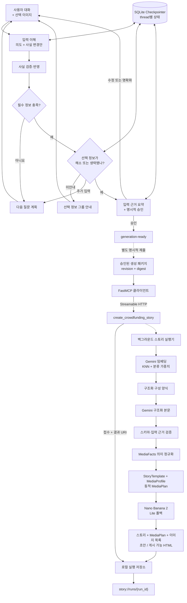

<p align="center">
  
</p>

<p align="center">
  <a href="https://www.python.org/"></a>
  <a href="https://docs.astral.sh/uv/"></a>
  <a href="https://gofastmcp.com/"></a>
  <a href="https://github.com/langchain-ai/langgraph"></a>
</p>

<p align="center">
  <a href="../README.md">English</a> | 한국어
</p>

<p align="center">
  제품 대화를 검토 가능한 펀딩 본문·생성 이미지·편집 가능한 HTML로 변환합니다.
</p>

---

Funding Story AI는 펀딩 스토리를 준비하기 위한 검토 중심 파이프라인입니다. 메이커가 제공한
제품 정보를 대화로 수집하고, 부족한 정보를 질문한 뒤, 입력 근거를 요약해 확인받습니다.
사용자가 승인한 요청은 구성 양식 검색, 본문·이미지 생성, 검증과 HTML 렌더링을 비동기 작업으로
제출합니다.

[기능](#funding-story-ai는-어떤-기능을-하나요) · [빠른 시작](#-빠른-시작) ·
[예제](#-포함된-예제) · [처리 구조](#-처리-구조) · [결과물](#-어떤-결과물을-받나요)

## Funding Story AI는 어떤 기능을 하나요?

### 대화형 정보 수집

- 1,000자 이하 사용자 메시지와 10MB 이하 JPG·PNG·WEBP 이미지 1개를 입력받습니다.
- 제품명·유형·분류, 강점, 대상, 문제, 증빙, 메이커 정보, 리워드, 일정, 정책, 펀딩금 사용
  계획, 플랫폼 선택 이유와 위험 대응 등 16개 스토리 정보를 수집합니다.
- 대화 모델이 의도, 사실 변경, 선택 정보 지시와 다음 질문을 이해합니다. LangGraph가
  `thread_id`별 대화 상태를 유지합니다.
- 질문 목적에 따라 관련 항목을 묶어 한 번에 최대 3개까지 질문합니다.
- 입력된 정보, 실제로 없음, 이번 스토리에서 생략한 정보를 구분합니다.
- 수집한 정보를 요약하고 사용자의 명시적 승인을 받은 뒤에만 `generation-ready` 상태로
  이동합니다.
- 이미지는 직접 보이는 외형 정보의 근거로만 사용합니다. 이미지에서 성능·인증·내부 구조·팀
  경력을 추정하지 않습니다.

### 구성 양식 기반 스토리 생성

- 제품 정보로 검색용 질의를 만들고 `gemini-embedding-001`과 코사인 KNN으로 구조화된 구성
  양식을 검색합니다.
- 의미 점수에 같은 분류 가중치를 더해 실행 가능한 구성 양식을 선택합니다.
- 선택된 영역 구조를 Gemini가 채우며, 검토를 위해 입력 출처 필드를 함께 보존합니다.
- 선택된 구성 양식에 따라 영역별 이미지 지시를 생성합니다.

### 계획 기반 이미지와 게시 가능 HTML

- 승인된 제품 사실을 로봇청소기 8개 능력군으로 정규화합니다.
- 선택된 스토리 구성 양식과 제품군 미디어 프로필을 결합해 최대 8개의 근거 있는 이미지
  슬롯을 동적으로 계획합니다.
- Nano Banana 2(`gemini-3.1-flash-image`)를 사용하고 Nano Banana 2 Lite
  (`gemini-3.1-flash-lite-image`)를 제한적으로 폴백하며 슬롯에 지정된 참조 자산만 전달합니다.
- 모델·시도 횟수·해시·근거 참조와 사람 검토 항목을 이미지 목록에 기록합니다.
- 740px 순수 초안 HTML은 항상 만들고 필수 정보·자산·생성·이미지 검토를 모두 통과한
  경우에만 게시 가능 HTML을 만듭니다.

## 🚀 빠른 시작

### 1. 설치

Python 3.12, [uv](https://docs.astral.sh/uv/)와 Google Cloud CLI가 필요합니다.

```bash
git clone https://github.com/pakyeon/funding-story-ai.git
cd funding-story-ai
uv sync --locked
cp .env.example .env
gcloud auth application-default login
```

### 2. 환경 설정

`.env`에 Google Cloud 프로젝트를 설정합니다.

```dotenv
GOOGLE_CLOUD_PROJECT=your-gcp-project
GEMINI_IMAGE_MODEL=gemini-3.1-flash-image
GEMINI_IMAGE_FALLBACK_MODEL=gemini-3.1-flash-lite-image
```

모델·재시도·출력·검색 설정은 [`.env.example`](../.env.example)에 정리되어 있습니다.

### 3. 로컬 생성 서버 실행

```bash
uv run funding-story server --host 127.0.0.1 --port 8765
```

서버는 로컬 loopback 주소에서만 요청을 받습니다.

### 4. 승인된 생성 패키지 제출

두 번째 터미널에서 실행합니다.

```bash
uv run funding-story submit \
  --generation-package path/to/approved-generation-package.json \
  --idempotency-key robot-vacuum-demo-v2 \
  --live
```

생성 패키지는 현재 대화 요약을 사용자가 명시적으로 승인한 뒤
`StoryGenerationDispatcher`가 만듭니다. 명령은 이 불변 패키지를 제출하고
`story://runs/{run_id}` 리소스가 완료 또는 실패할 때까지 조회합니다.

## 대화 API

```python
import asyncio

from funding_story_ai import WorkerRequest, build_live_worker

worker = build_live_worker()
outcome = asyncio.run(
    worker.handle(
        WorkerRequest(
            thread_id="demo-conversation-01",
            input_id="demo-01",
            message=(
                "클린포지 R1은 가구 아래를 자주 청소하는 사용자를 위한 "
                "얇은 로봇청소기이며 도크가 모인 먼지를 비웁니다."
            ),
        )
    )
)

print(outcome.stage)
print(outcome.reply)
```

한 대화의 모든 입력에는 같은 `thread_id`를 사용합니다. LangGraph SQLite Checkpointer가
메시지, 구조화 사실, 선택 정보 상태, 질문 이력, 현재 요약과 승인 버전을 유지합니다.
worker는 `generation-ready`에서 멈추며, 생성 제출은 별도의 명시적 작업입니다.

## 🧹 포함된 예제

<p align="center">
  
</p>

포함된 로봇청소기는 실제 제품이나 펀딩이 아닌 합성 자료입니다. 바로 실행할 수 있는 입력
패키지는 다음 파일로 구성됩니다.

- [`brief.json`](../examples/robot-vacuum/brief.json) — 제품 사실·주장·증빙·미확인 정보
- [`product-reference.png`](../examples/robot-vacuum/product-reference.png) — 참조 이미지

## 🏗 처리 구조



대화 worker와 스토리 실행기는 책임을 나누어 동작합니다. 생성 요청은 승인된
`generation-ready` 상태에서만 접수됩니다.

## 어떤 결과물을 받나요?

완료된 실행은 다음 결과물을 포함합니다.

```text
brief.json                 # 입력에 근거한 구조화 정보
story.json                 # 생성 영역과 출처 필드
media-facts.json            # 미디어 계획용으로 정규화된 승인 사실
media-plan.json             # 활성 슬롯·배치·참조와 placeholder
images/manifest.json        # 모델·시도·해시·근거와 검토 항목
images/{slot}.{format}      # 독립 생성한 MediaPlan 슬롯 이미지
draft.html                  # 고정 placeholder가 있는 순수 초안 HTML
publishable.html            # 모든 게시 gate 통과 시에만 생성
```

같은 호출자·멱등성 키·입력을 다시 제출하면 기존 실행을 반환합니다. 다른 입력에 같은
멱등성 키를 사용하면 요청이 거부됩니다.

## 사용 안내

- 포함된 대화 흐름과 예제 구성 양식은 한국어 작업 흐름을 기준으로 합니다.
- 게시 전에 생성된 본문·이미지·경고·출처 필드를 검토하세요.
- API 인증 정보는 `.env`에 보관하고 커밋하지 마세요.

## 더 알아보기

- [처리 구조](../docs/architecture.md)
- [구성 양식·검색 시스템](../docs/template-system.md)
- [입력 근거 검증](../docs/factuality-and-validation.md)
