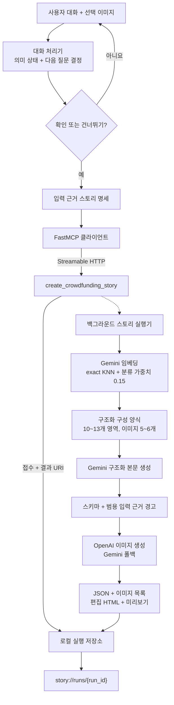

<p align="center">
  
</p>

<p align="center">
  <a href="https://www.python.org/"></a>
  <a href="https://docs.astral.sh/uv/"></a>
  <a href="https://gofastmcp.com/"></a>
  <a href="https://github.com/langchain-ai/langgraph"></a>
</p>

<p align="center">
  <a href="../README.md">English</a> | 한국어
</p>

<p align="center">
  제품 대화를 검토 가능한 펀딩 본문·생성 이미지·편집 가능 HTML로 변환하는<br>
  실험적 구현입니다.
</p>

---

Funding Story AI는 대화 입력과 스토리 실행을 분리합니다. 대화 LLM이 메이커가 제공한
사실을 추출하고 다음 질문을 결정합니다. 사용자가 명시적으로 확인한 뒤에는 단일
FastMCP 도구가 구성 양식 검색, 본문·이미지 생성, 검증과 렌더링 작업을 비동기로
제출합니다.

[기능](#funding-story-ai는-어떤-기능을-하나요) · [빠른 시작](#-빠른-시작) ·
[예제](#-포함된-예제) · [처리 구조](#-처리-구조) ·
[구현 범위](#구현-범위) · [한계](#-현재-한계)

## Funding Story AI는 어떤 기능을 하나요?

### 대화 입력

- 1,000자 이하 사용자 메시지와 10MB 이하 JPG·PNG·WEBP 이미지 1개를 입력받습니다.
- 제품명·유형·분류, 강점, 대상, 문제, 신뢰 정보, 메이커 소개, 리워드, 일정·정책,
  펀딩금 사용 계획, 플랫폼 선택 이유와 위험 대응을 구조화합니다.
- 제품 프로필이나 UI 완료 표시가 아니라 대화 LLM이 질문 여부와 질문 내용을
  결정합니다. 서로 밀접한 항목은 한 질문으로 묶을 수 있습니다.
- 한국어·영어·일본어·중국어 상태와 출력 계약을 지원합니다.
- 이미지는 직접 보이는 외형 정보의 근거로만 사용합니다. 성능·인증·내부 구조·팀
  경력을 이미지에서 추정하지 않습니다.

### 구성 양식 검색과 본문 생성

- 제품 정보와 축소된 검색 후보 16개를 `gemini-embedding-001`로 임베딩합니다.
- exact cosine KNN 점수에 동일 분류 가중치 `0.15`를 기본으로 더합니다.
- 연구용 후보가 실행 가능한 골격을 갖지 않으면 순위상 다음 실행 가능 후보를
  선택합니다.
- 선택된 구조화 구성 양식을 Gemini가 채웁니다. 로컬 구성 양식 6개는 각각 10~13개
  영역과 5~6개 이미지 계약을 갖습니다.

### 이미지·검토·편집 결과

- OpenAI 키가 있으면 `gpt-image-2`를 먼저 사용하고
  `gemini-2.5-flash-image`로 폴백합니다. 공급자별 최대 3회 시도합니다.
- 정상 PNG에는 tEXt, JPEG에는 COM 메타데이터로 AI 생성 표시를 기록하고 공급자,
  모델, MIME 유형, 시도 횟수, 해시와 검토 상태를 생성 목록에 보존합니다.
- 생성 성공 이미지를 미리보기에 표시하되 사람 검토 대기 상태를 명시합니다.
- 검증 경고가 있어도 전체 스토리를 자동 재생성하지 않습니다.
- 독립 실행 미리보기와 Froala 계열 편집기로 가져갈 수 있는 보수적 HTML 조각을 함께
  만듭니다.

## 🚀 빠른 시작

### 1. 설치

Python 3.12, [uv](https://docs.astral.sh/uv/)와 Google Cloud CLI가 필요합니다.

```bash
git clone https://github.com/pakyeon/funding-story-ai.git
cd funding-story-ai
uv sync --locked
cp .env.example .env
gcloud auth application-default login
```

### 2. 환경 설정

`.env`에 GCP 프로젝트를 설정합니다. `OPENAI_API_KEY`는 선택 사항이며, 없으면 이미지
경로가 Gemini 폴백 모델을 사용합니다.

```dotenv
GOOGLE_CLOUD_PROJECT=your-gcp-project
OPENAI_API_KEY=your-openai-api-key
```

모델, 재시도, 출력 크기와 검색 설정은 [`.env.example`](../.env.example)을 참고합니다.

### 3. 로컬 생성 서버 실행

```bash
uv run funding-story server --host 127.0.0.1 --port 8765
```

서버는 loopback 주소에만 바인딩됩니다.

### 4. 포함된 예제 생성

두 번째 터미널에서 실행합니다.

```bash
uv run funding-story submit \
  --brief-path examples/robot-vacuum/brief.json \
  --reference-image examples/robot-vacuum/product-reference.png \
  --idempotency-key robot-vacuum-demo-v2 \
  --live
```

명령은 작업을 제출하고 `story://runs/{run_id}` 리소스가 완료 또는 실패할 때까지
조회합니다. 완료 결과는 다음 파일을 포함합니다.

```text
brief.json                 # 입력에 근거한 구조화 정보
story.json                 # 생성 영역과 출처 필드
images/manifest.json       # 공급자·시도·해시·검토 상태
images/{section}.{format}  # 구성 양식이 선택한 이미지 5~6개
editor.html                # 보수적인 편집용 HTML 조각
preview.html               # 사람 검토용 독립 미리보기
```

같은 호출자·멱등성 키·입력을 다시 제출하면 기존 실행을 반환합니다. 같은 키를 다른
입력에 사용하면 충돌로 처리합니다.

### 선택 사항: Streamlit 데모

이 브랜치는 로컬 채팅 UI를 포함합니다. FastMCP 서버를 실행한 상태에서 다른 터미널에
다음을 실행합니다.

```bash
uv run --group ui streamlit run streamlit_app.py
```

제품 설명과 선택 이미지는 채팅 입력에서 함께 제출합니다. UI는 내부 서버 URL, 검색
설정이나 제품 프로필을 노출하지 않습니다. 생성 산출물은 UI가 서버 실행 디렉터리를 직접
여는 대신 FastMCP 실행 리소스로 읽습니다.

## 대화 API

```python
import asyncio

from funding_story_ai import WorkerRequest, build_live_worker

worker = build_live_worker()
outcome = asyncio.run(
    worker.handle(
        WorkerRequest(
            input_id="demo-01",
            initial_message=(
                "OrbitClean V3는 가구 아래를 자주 청소하는 사용자를 위한 "
                "얇은 로봇청소기이며 도크가 모인 먼지를 비웁니다."
            ),
        )
    )
)

print(outcome.stage)
print(outcome.questions)
```

호출자는 대화 내역과 반환된 `semantic_state`를 보관하고 다음 요청의
`prior_semantic_state`로 전달합니다. `confirmed=True` 또는 `skip_requested=True`는
사용자 행동 뒤에만 설정합니다.

## 🧹 포함된 예제

<p align="center">
  
</p>

포함된 로봇청소기는 실제 제품이나 펀딩이 아닌 합성 자료입니다.

- [`brief.json`](../examples/robot-vacuum/brief.json) — 제품 사실·주장·증빙·미확인 정보
- [`product-reference.png`](../examples/robot-vacuum/product-reference.png) — 합성 참조 이미지

## 🏗 처리 구조



worker가 보는 MCP 표면에는 생성 도구 하나만 공개합니다. 이는 외부 서비스의 전체 MCP
서버가 도구 하나만 가진다는 뜻이 아닙니다. Streamable HTTP와 Gemini 본문 모델은 로컬
구현 선택이며 비공개 운영 설정과 같다고 주장하지 않습니다.

## 구현 범위

| 영역 | 현재 구현 |
|---|---|
| 대화 | Gemini 멀티모달 의미 추출·다음 질문 결정, LangGraph 상태 전환 통제 |
| 도구 경계 | worker 허용 목록의 FastMCP 생성 도구 1개와 실행 리소스 1개 |
| 실행 | 멱등성을 갖춘 비차단 로컬 백그라운드 작업 |
| 검색 | 축소 후보 16개 exact KNN, 기본 분류 가중치 `0.15` |
| 구성 양식 | 로봇청소기 PoC용 6개, 서로 다른 영역·이미지 수 |
| 본문 | Gemini 3.7 Flash, 접근 실패 5회 뒤 Gemini 3.6 Flash |
| 이미지 | 설정 시 OpenAI 우선, Gemini 폴백, 공급자별 최대 3회 |
| 검증 | JSON Schema, 출처 필드, 미지원 수치, 미래 약속, 내부 식별자 검사 |
| 결과 | 구조화 입력, 본문, 이미지 목록, 편집 HTML, 미리보기, SHA-256 |
| 데모 UI | 이미지 1개 첨부가 가능한 Streamlit 채팅과 MCP 리소스 결과 표시 |

## 개발 검증

```bash
uv lock --check
uv run ruff check .
uv run pytest
uv run funding-story validate
```

테스트는 로컬 가짜 구현을 사용하며 유료 모델 API를 호출하지 않습니다.

## 문서

- [처리 구조](../docs/architecture.md)
- [구성 양식·검색 시스템](../docs/template-system.md)
- [입력 근거 검증](../docs/factuality-and-validation.md)
- [관찰 가능한 동작 조사](../docs/research/observable-story-ai-behavior.md)
- [PoC 평가 요약](../docs/research/poc-evaluation-summary.md)
- [현재 한계](../docs/research/limitations.md)

## ⚠️ 현재 한계

- 동작 비교와 실행 가능 구성 양식은 한국어 로봇청소기 입력에 한정됩니다.
- 검색 후보 16개는 축소 기술 검증 자료이며 외부 서비스가 공개한 참조 구성 양식 102개
  자료가 아닙니다.
- 비공개 구성 양식 원본, Froala 허용 목록, 광고 심사 서비스, webhook payload,
  인프라와 운영 모델 설정은 공개되지 않았으므로 동일하다고 주장하지 않습니다.
- 로컬 실행 저장소는 단일 프로세스용이며 인증·인가·TLS·분산 내구성 큐가 없습니다.
- Streamlit 데모는 현재 브라우저 세션에만 대화를 보관하며 인증된 다중 사용자 앱이
  아닙니다.
- 자동 검사는 외부 사실, 광고 규정, 이미지 권리, 펀딩 성과 인과관계를 검증하지
  않습니다. 모든 결과는 사람의 검토가 필요합니다.
