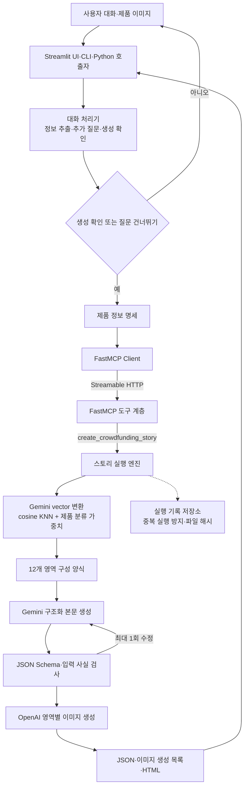

<p align="center">
  
</p>

<p align="center">
  <a href="https://www.python.org/"></a>
  <a href="https://docs.astral.sh/uv/"></a>
  <a href="https://gofastmcp.com/"></a>
  <a href="https://github.com/langchain-ai/langgraph"></a>
  <a href="https://github.com/pakyeon/funding-story-ai/actions/workflows/ci.yml"></a>
</p>

<p align="center">
  <a href="../README.md">English</a> | 한국어
</p>

<p align="center">
  제품 설명과 이미지를 입력받아 필요한 정보를 질문으로 보완하고,<br>
  펀딩 페이지용 텍스트·이미지·HTML을 생성하는 실험적 구현입니다.
</p>

---

Funding Story AI는 대화 입력, 구성 양식 검색, 본문 생성, 이미지 생성과 결과 검증을
분리된 단계로 실행합니다. 대화 처리기는 제품 정보를 정리하고 생성 시작 여부를
확인하며, 실제 생성은 FastMCP 도구를 통해 실행 엔진에 요청합니다.

[기능](#funding-story-ai는-어떤-기능을-하나요) · [빠른 시작](#-빠른-시작) ·
[UI 데모](#-streamlit-데모) · [사용 예시](#-포함된-예시-합성-로봇청소기) · [처리 구조](#-처리-구조) ·
[구현 범위](#구현-범위) · [한계](#-현재-범위와-한계)

## Funding Story AI는 어떤 기능을 하나요?

### 제품 정보 수집

사용자의 텍스트와 제품 이미지에서 다음 정보를 구조화합니다.

- 제품명과 제품 유형
- 핵심 특장점
- 예상 후원자와 사용 환경
- 해결하려는 문제
- 시험·인증·후기 등 신뢰 정보
- 제작자와 팀 소개

이미지는 색상과 형태처럼 직접 보이는 외형 정보에만 사용합니다. 이미지에서 성능,
인증, 내부 구조나 지원 기능을 추정하지 않습니다.

### 추가 질문과 생성 확인

필요한 정보가 부족하면 제품군 설정에 등록된 질문 예시를 사용해 후속 질문을 만듭니다.
사용자가 “없음”이라고 명시한 항목은 답변 완료로 처리합니다. 정보 충돌이 있으면 최종
값을 먼저 확인하며, 확인 또는 질문 건너뛰기 전에는 생성 도구를 호출하지 않습니다.

### 구성 양식 검색

정리된 제품 정보와 16개 검색 후보를 `vector`로 변환하고 cosine 유사도를 계산합니다.
동일 제품 분류의 후보에는 설정된 가중치를 더합니다. 현재 검색 후보 중 6개가 실제 생성에
사용할 수 있는 구성 양식입니다.

### 텍스트와 이미지 생성

선택된 구성 양식의 12개 영역에 맞춰 펀딩 페이지 본문을 생성합니다. `hero`,
`solution`, `features` 영역에는 제품 참조 이미지를 이용한 이미지 또는 동일한 외형을
유지하는 새 이미지를 생성합니다.

### 결과 검증과 저장

생성 결과에서 입력에 없는 수치, 기능, 인증, 일정과 미래 약속 표현을 검사합니다.
제품 정보, 본문, 이미지 생성 목록과 HTML 미리보기를 하나의 실행 기록에 저장하고 각
파일의 SHA-256을 함께 기록합니다. 모든 결과에는 사람의 최종 검토가 필요합니다.

## 🚀 빠른 시작

### 1. 설치

Python 3.12, [uv](https://docs.astral.sh/uv/)와 Google Cloud CLI가 필요합니다.

```bash
git clone https://github.com/pakyeon/funding-story-ai.git
cd funding-story-ai
uv sync --locked
cp .env.example .env
gcloud auth application-default login
```

### 2. 환경 변수 설정

`.env`에서 다음 값을 설정합니다.

```dotenv
GOOGLE_CLOUD_PROJECT=your-gcp-project
OPENAI_API_KEY=your-openai-api-key
```

모델, region과 출력 크기의 전체 설정은 [`.env.example`](../.env.example)에서
확인할 수 있습니다.

### 3. 생성 서버 실행

첫 번째 터미널에서 현재 컴퓨터의 FastMCP 서버를 시작합니다.

```bash
uv run funding-story server --host 127.0.0.1 --port 8765
```

서버는 기본적으로 현재 컴퓨터에서만 접근할 수 있습니다.

### 4. 펀딩 페이지 생성

두 번째 터미널에서 포함된 제품 정보 명세와 제품 이미지를 제출합니다.

```bash
uv run funding-story submit \
  --brief-path examples/robot-vacuum/brief.json \
  --reference-image examples/robot-vacuum/product-reference.png \
  --category-profile robot-vacuum-ko-v1 \
  --idempotency-key robot-vacuum-demo-v1 \
  --live
```

생성이 완료되면 `artifacts/runs/run-…/` 아래에 다음 결과가 만들어집니다.

```text
brief.json                 # 입력에 사용한 제품 정보 명세
story.json                 # 생성된 본문과 근거 필드
images/manifest.json       # 이미지별 상태·검토 상태
images/{section}.jpeg      # 영역별 생성 이미지
preview.html               # 편집 가능한 결과 미리보기
```

같은 요청자, `--idempotency-key`와 입력으로 다시 요청하면 기존 실행 결과를 반환합니다.
같은 키에 다른 입력을 사용하면 중복 실행 오류로 처리합니다.

## 🖥 Streamlit 데모

UI는 `feat/streamlit-demo` 브랜치에서 관리하며, 명령줄 실행과 동일한 대화 처리기와
로컬 FastMCP 생성 도구를 호출합니다. 배포용 서비스가 아니라 현재 기능을 로컬에서
공유하고 시연하기 위한 화면입니다.

첫 번째 터미널에서 생성 서버를 실행합니다.

```bash
uv run funding-story server --host 127.0.0.1 --port 8765
```

두 번째 터미널에서 UI를 실행합니다.

```bash
uv sync --locked --group ui
uv run --group ui streamlit run streamlit_app.py
```

`http://127.0.0.1:8501`에 접속해 제품 기준 이미지를 선택적으로 첨부하고 제품을
설명합니다. UI에서 후속 질문에 답하고 생성을 명시적으로 승인하면 HTML 미리보기,
섹션별 원고, 생성 이미지, JSON 결과를 확인할 수 있습니다. API 인증 정보는 UI에
입력하지 않고 로컬 `.env` 파일에만 둡니다.

## 대화 입력 사용

대화 처리기는 입력 상태를 판단하고, 생성이 승인되면 FastMCP 서버에 작업을
위임합니다.

```python
import asyncio

from funding_story_ai import WorkerRequest, build_live_worker

agent = build_live_worker()
result = asyncio.run(
    agent.handle(
        WorkerRequest(
            input_id="robot-demo-01",
            initial_message=(
                "얇은 본체와 자동 먼지 비움이 강점인 로봇청소기입니다. "
                "가구 아래 반복 청소가 필요한 사용자를 위한 페이지를 만들고 싶어요."
            ),
        )
    )
)

print(result.status)
print(result.questions)
```

호출 프로그램은 반환된 `semantic_state`와 대화 내용을 보관해야 합니다. 후속
입력을 추가하고 `confirmed=True` 또는 `skip_requested=True`로 요청하기 전에는 생성이
시작되지 않습니다.

## 🧹 포함된 예시: 합성 로봇청소기

<p align="center">
  
</p>

이 예시는 실제 판매 제품이나 펀딩 원문이 아닌 합성 데이터입니다.

| 입력 영역 | 예시 내용 | 처리 방식 |
|---|---|---|
| 제품 사실 | 흡입력, 작동 시간, 물걸레·충전 거치대 사양 | 값과 출처 ID 연결 |
| 사용자 문제 | 반복 청소와 청소 후 관리 부담 | 질문과 검색 질의에 사용 |
| 증빙 | 합성 자체 시험 2건 | 외부 인증과 구분 |
| 미확인 | 가격, 배송일, 외부 인증, 보증 | 임의로 채우지 않고 미확인 상태 유지 |
| 결과 | 공통 역할 12개, 이미지 3개 | JSON·HTML·이미지 생성 목록과 경고 반환 |

예시 파일:

- [`brief.json`](../examples/robot-vacuum/brief.json) — 제품 정보와 출처·미확인 항목
- [`product-reference.png`](../examples/robot-vacuum/product-reference.png) — 합성 제품 이미지
- [`robot-vacuum-ko-v1.json`](../profiles/robot-vacuum-ko-v1.json) — 제품군별 추출·질문 설정

## 적용 가능한 입력 상황

### 제품 정보가 충분한 경우

제품명, 특장점, 예상 후원자와 신뢰 정보가 입력되면 추가 질문을 줄이고 생성 확인
단계로 이동합니다.

### 신뢰 정보가 없는 경우

시험, 인증, 후기 또는 팀 정보가 없다고 명시하면 이를 사실로 기록합니다. 시스템은
해당 정보를 새로 만들지 않고 결과에서 검토가 필요한 영역을 표시합니다.

### 제품 사양이 변경된 경우

이전 수치와 최신 수치가 함께 입력되면 최종 값을 확인합니다. 첨부 이미지가 폐기된
시제품이라면 해당 이미지를 새 이미지 생성의 참조로 사용하지 않습니다.

### 구성 양식 검색을 조정하는 경우

제품 분류 가중치는 `0.0`, `0.1`, `0.2` 중 하나로 설정할 수 있습니다. 같은 제품
분류와 다른 제품 분류의 오검색 검증 후보를 포함해 검색 결과 변화를 확인할 수 있습니다.

## 🏗 처리 구조



### 구성 요소별 책임

| 구성 요소 | 담당 기능 | 직접 수행하지 않는 기능 |
|---|---|---|
| Streamlit UI | 로컬 대화, 기준 이미지 업로드, 결과 표시 | 인증 정보·생성 로직 관리 |
| 대화 처리기 | 텍스트·이미지 정보 추출, 질문, 생성 확인 | 본문·이미지 생성 |
| FastMCP 도구 계층 | 입력 형식 검사, 작업 요청, 결과 조회, 중복 실행 방지 | 본문 작성 |
| 구성 양식 검색기 | `vector` 유사도 계산과 제품 분류 가중치 적용 | 모델 호출 결과 작성 |
| 실행 엔진 | 본문·이미지·HTML을 하나의 실행 기록으로 조립 | 대화 상태 관리 |
| 결과 검사기 | JSON 형식, 수치, 미지원 주장과 근거 필드 검사 | 외부 사실의 진위 판정 |

자세한 설명은 [아키텍처 문서](../docs/architecture.md)에서 확인할 수 있습니다.

## 구현 범위

| 영역 | 현재 구현 |
|---|---|
| 대화 입력 | Gemini 텍스트·이미지 분석과 LangGraph 질문 흐름 |
| 생성 권한 | 대화 처리기가 호출할 수 있는 FastMCP 도구 1개 |
| 통신 | FastMCP 3.x Streamable HTTP, loopback 주소만 허용 |
| 실행 관리 | 요청자별 중복 실행 방지, 비동기 작업, 실행 결과 조회 |
| 구성 양식 | 설득 전략 6종, 공통 12개 결과 영역 |
| 검색 | 후보 16개 전체 cosine KNN, 768차원 `vector`, 제품 분류 가중치 |
| 텍스트 | Gemini 3.7 Flash 우선, 접근 실패 5회 뒤 3.6 Flash 사용 |
| 검사 | JSON Schema, 입력에 없는 수치·기능·일정·인증 표현 검사 |
| 이미지 | `gpt-image-2`, 3개 주요 영역, 이미지별 실패 분리 |
| 결과 | 제품 정보 명세·본문·이미지 생성 목록·HTML·SHA-256 |

## 결과 해석

`automated_validation_passed`는 외부 사실이 참으로 확인됐다는 뜻이 아닙니다. 사용자
입력과 생성 결과 사이의 충돌 및 현재 검사기에 등록된 무근거 표현을 찾지 못했다는
뜻입니다.

1. 사용자 진술과 외부 검증 증거를 구분합니다.
2. 이미지에서 보이지 않는 성능·인증·내부 구조를 추론하지 않습니다.
3. 미입력 가격·일정·후기·A/S 정보를 만들지 않습니다.
4. 검사 경고나 이미지 실패가 있으면 실행 상태를 `partial`로 표시합니다.
5. 모든 결과는 `review_required: true`이며 이미지도 별도 검토가 필요합니다.

## 개발 검증

아래 명령은 기능 사용이 아니라 저장소 변경 후 회귀 검사를 위한 개발자 명령입니다.

```bash
uv lock --check
uv run ruff check .
uv run pytest
uv run funding-story validate
```

현재 저장소 기준:

- pytest 62개 통과
- JSON Schema 11개
- 12개 영역 구성 양식 6개
- 검색 후보 16개
- FastMCP 작업·결과 조회·중복 실행 방지 회귀 검사
- 로봇청소기 제품군 설정 1개와 합성 입력 1세트

선행 로직 증류의 두 번째 미공개 검증 사례에서는 대화 처리기 → FastMCP → 검색 →
실행 엔진 경로가 끝까지 동작했습니다. 외부 기준이 생성 확인으로 이동한 입력에서 당시
내부 실험 구현은 보조 질문을 반환했습니다. 현재 구현은 “명시적으로 없음”을 답변
완료로 처리하도록 수정했지만, 외부 서비스와 전면적으로 동일하다는 의미는 아닙니다.

## 저장소 구조

```text
funding-story-ai/
├── src/funding_story_ai/
│   ├── worker.py             # 대화 입력·질문·제품 정보 명세 생성
│   ├── mcp_server.py         # FastMCP 단일 생성 도구
│   ├── template_retrieval.py # vector 검색과 제품 분류 가중치
│   ├── engine.py             # 통합 실행 엔진
│   └── ...                   # 본문·검사·이미지·HTML 생성
├── schemas/                  # JSON 입력·출력 형식
├── templates/                # 구성 양식 6개와 검색 후보
├── profiles/                 # 제품군별 추출·질문 설정
├── examples/                 # 합성 입력 예시
├── docs/                     # 설계와 연구 범위 문서
└── tests/                    # 외부 모델 호출 없는 회귀 검사
```

## 📚 문서

- [아키텍처](../docs/architecture.md)
- [구성 양식·검색 시스템](../docs/template-system.md)
- [입력 사실 검사](../docs/factuality-and-validation.md)
- [제품군 설정](../docs/category-profiles.md)
- [관찰 가능한 Story AI 동작](../docs/research/observable-story-ai-behavior.md)
- [PoC 평가 요약](../docs/research/poc-evaluation-summary.md)
- [현재 한계](../docs/research/limitations.md)

## ⚠️ 현재 범위와 한계

- 질문 흐름과 결과 품질 비교는 한국어 로봇청소기에 한정됩니다.
- 대화 상태를 보관하는 웹 UI는 없습니다.
- 실행 기록 저장소는 단일 프로세스 개발용이며 사용자 인증과 권한 분리를 제공하지 않습니다.
- 검색 후보 16개는 검색 방식 확인을 위한 축소 집합입니다.
- 구성 양식과 실제 펀딩 성과 사이의 인과 관계를 검증하지 않았습니다.
- 외부 사실 검색, 광고 심사와 권리 검토는 포함하지 않습니다.
